# Modular Monolith with DDD

Full Modular Monolith .NET application with Domain-Driven Design approach.

## Announcement


Learn, use and benefit from this project only if:

- You **condemn Russia and its military aggression against Ukraine**
- You **recognize that Russia is an occupant that unlawfully invaded a sovereign state**
- You **support Ukraine's territorial integrity, including its claims over temporarily occupied territories of Crimea and Donbas**
- You **reject false narratives perpetuated by Russian state propaganda**

Otherwise, leave this project immediately and educate yourself.

Putin, idi nachuj.

## CI


## FrontEnd application

FrontEnd application : [Modular Monolith With DDD: FrontEnd React application](https://github.com/kgrzybek/modular-monolith-with-ddd-fe-react)

## Table of contents

[1. Introduction](#1-introduction)

&nbsp;&nbsp;[1.1 Purpose of this Repository](#11-purpose-of-this-repository)

&nbsp;&nbsp;[1.2 Out of Scope](#12-out-of-scope)

&nbsp;&nbsp;[1.3 Reason](#13-reason)

&nbsp;&nbsp;[1.4 Disclaimer](#14-disclaimer)

&nbsp;&nbsp;[1.5 Give a Star](#15-give-a-star)

&nbsp;&nbsp;[1.6 Share It](#16-share-it)

[2. Domain](#2-domain)

&nbsp;&nbsp;[2.1 Description](#21-description)

&nbsp;&nbsp;[2.2 Conceptual Model](#22-conceptual-model)

&nbsp;&nbsp;[2.3 Event Storming](#23-event-storming)

[3. Architecture](#3-architecture)

&nbsp;&nbsp;[3.0 C4 Model](#30-c4-model)

&nbsp;&nbsp;[3.1 High Level View](#31-high-level-view)

&nbsp;&nbsp;[3.2 Module Level View](#32-module-level-view)

&nbsp;&nbsp;[3.3 API and Module Communication](#33-api-and-module-communication)

&nbsp;&nbsp;[3.4 Module Requests Processing via CQRS](#34-module-requests-processing-via-cqrs)

&nbsp;&nbsp;[3.5 Domain Model Principles and Attributes](#35-domain-model-principles-and-attributes)

&nbsp;&nbsp;[3.6 Cross-Cutting Concerns](#36-cross-cutting-concerns)

&nbsp;&nbsp;[3.7 Modules Integration](#37-modules-integration)

&nbsp;&nbsp;[3.8 Internal Processing](#38-internal-processing)

&nbsp;&nbsp;[3.9 Security](#39-security)

&nbsp;&nbsp;[3.10 Unit Tests](#310-unit-tests)

&nbsp;&nbsp;[3.11 Architecture Decision Log](#311-architecture-decision-log)

&nbsp;&nbsp;[3.12 Architecture Unit Tests](#312-architecture-unit-tests)

&nbsp;&nbsp;[3.13 Integration Tests](#313-integration-tests)

&nbsp;&nbsp;[3.14 System Integration Testing](#314-system-integration-testing)

&nbsp;&nbsp;[3.15 Event Sourcing](#315-event-sourcing)

&nbsp;&nbsp;[3.16 Database change management](#316-database-change-management)

&nbsp;&nbsp;[3.17 Continuous Integration](#317-continuous-integration)

&nbsp;&nbsp;[3.18 Static code analysis](#318-static-code-analysis)

&nbsp;&nbsp;[3.19 System Under Test SUT](#319-system-under-test-sut)

&nbsp;&nbsp;[3.20 Mutation Testing](#320-mutation-testing)

[4. Technology](#4-technology)

[5. How to Run](#5-how-to-run)

[6. Contribution](#6-contribution)

[7. Roadmap](#7-roadmap)

[8. Authors](#8-authors)

[9. License](#9-license)

[10. Inspirations and Recommendations](#10-inspirations-and-recommendations)

## 1. Introduction

### 1.1 Purpose of this Repository

This is a list of the main goals of this repository:

- Showing how you can implement a **monolith** application in a **modular** way
- Presentation of the **full implementation** of an application
  - This is not another simple application
  - This is not another proof of concept (PoC)
  - The goal is to present the implementation of an application that would be ready to run in production
- Showing the application of **best practices** and **object-oriented programming principles**
- Presentation of the use of **design patterns**. When, how and why they can be used
- Presentation of some **architectural** considerations, decisions, approaches
- Presentation of the implementation using **Domain-Driven Design** approach (**tactical** patterns)
- Presentation of the implementation of **Unit Tests** for Domain Model (Testable Design in mind)
- Presentation of the implementation of **Integration Tests**
- Presentation of the implementation of **Event Sourcing**
- Presentation of **C4 Model**
- Presentation of **diagram as text** approach

### 1.2 Out of Scope

This is a list of subjects which are out of scope for this repository:

- Business requirements gathering and analysis
- System analysis
- Domain exploration
- Domain distillation
- Domain-Driven Design **strategic** patterns
- Architecture evaluation, quality attributes analysis
- Integration, system tests
- Project management
- Infrastructure
- Containerization
- Software engineering process
- Deployment process
- Maintenance
- Documentation

### 1.3 Reason

The reason for creating this repository is the lack of something similar. Most sample applications on GitHub have at least one of the following issues:

- Very, very simple - few entities and use cases implemented
- Not finished (for example there is no authentication, logging, etc..)
- Poorly designed (in my opinion)
- Poorly implemented (in my opinion)
- Not well described
- Assumptions and decisions are not clearly explained
- Implements "Orders" domain - yes, everyone knows this domain, but something different is needed
- Implemented in old technology
- Not maintained

To sum up, there are some very good examples, but there are far too few of them. This repository has the task of filling this gap at some level.

### 1.4 Disclaimer

Software architecture should always be created to resolve specific **business problems**. Software architecture always supports some quality attributes and at the same time does not support others. A lot of other factors influence your software architecture - your team, opinions, preferences, experiences, technical constraints, time, budget, etc.

Always functional requirements, quality attributes, technical constraints and other factors should be considered before an architectural decision is made.

Because of the above, the architecture and implementation presented in this repository is **one of the many ways** to solve some problems. Take from this repository as much as you want, use it as you like but remember to **always pick the best solution which is appropriate to the problem class you have**.

### 1.5 Give a Star

My primary focus in this project is on quality. Creating a good quality product involves a lot of analysis, research and work. It takes a lot of time. If you like this project, learned something or you are using it in your applications, please give it a star :star:.  This is the best motivation for me to continue this work. Thanks!

### 1.6 Share It

There are very few really good examples of this type of application. If you think this repository makes a difference and is worth it, please share it with your friends and on social networks. I will be extremely grateful.

## 2. Domain

### 2.1 Description

**Definition:**

> Domain - A sphere of knowledge, influence, or activity. The subject area to which the user applies a program is the domain of the software. [Domain-Driven Design Reference](http://domainlanguage.com/ddd/reference/), Eric Evans

The **Meeting Groups** domain was selected for the purposes of this project based on the [Meetup.com](https://www.meetup.com/) system.

**Main reasons for selecting this domain:**

- It is common, a lot of people use the Meetup site to organize or attend meetings
- There is a system for it, so everyone can check this implementation against a working site which supports this domain
- It is not complex so it is easy to understand
- It is not trivial - there are some business rules and logic and it is not just CRUD operations
- You don't need much specific domain knowledge unlike other domains like financing, banking, medical
- It is not big so it is easier to implement

**Meetings**

The main business entities are `Member`, `Meeting Group` and `Meeting`. A `Member` can create a `Meeting Group`, be part of a `Meeting Group` or can attend a `Meeting`.

A `Meeting Group Member` can be an `Organizer` of this group or a normal `Member`.

Only an `Organizer` of a `Meeting Group` can create a new `Meeting`.

A `Meeting` has attendees, not attendees (`Members` which declare they will not attend the `Meeting`) and `Members` on the `Waitlist`.

A `Meeting` can have an attendee limit. If the limit is reached, `Members` can only sign up to the `Waitlist`.

A `Meeting Attendee` can bring guests to the `Meeting`. The number of guests allowed is an attribute of the `Meeting`. Bringing guests can be unallowed.

A `Meeting Attendee` can have one of two roles: `Attendee` or `Host`. A `Meeting` must have at least one `Host`. The `Host` is a special role which grants permission to edit `Meeting` information or change the attendees list.

A `Member` can comment `Meetings`. A `Member` can reply to, like other `Comments`. `Organizer` manages commenting of `Meeting` by `Meeting Commenting Configuration`. `Organizer` can delete any `Comment`.

Each `Meeting Group` must have an organizer with active `Subscription`. One organizer can cover 3 `Meeting Groups` by his `Subscription`.

Additionally, Meeting organizer can set an `Event Fee`. Each `Meeting Attendee` is obliged to pay the fee. All guests should be paid by `Meeting Attendee` too.

**Administration**

To create a new `Meeting Group`, a `Member` needs to propose the group. A `Meeting Group Proposal` is sent to `Administrators`. An `Administrator` can accept or reject a `Meeting Group Proposal`. If a `Meeting Group Proposal` is accepted, a `Meeting Group` is created.

**Payments**

Each `Member` who is the `Payer` can buy the `Subscription`. He needs to pay the `Subscription Payment`. `Subscription` can expire so `Subscription Renewal` is required (by `Subscription Renewal Payment` payment to keep `Subscription` active).

When the `Meeting` fee is required, the `Payer` needs to pay `Meeting Fee` (through `Meeting Fee Payment`).

**Users**

Each `Administrator`, `Member` and `Payer` is a `User`. To be a `User`, `User Registration` is required and confirmed.

Each `User` is assigned one or more `User Role`.

Each `User Role` has set of `Permissions`. A `Permission` defines whether `User` can invoke a particular action.

### 2.2 Conceptual Model

**Definition:**

> Conceptual Model - A conceptual model is a representation of a system, made of the composition of concepts that are used to help people know, understand, or simulate a subject the model represents. [Wikipedia - Conceptual model](https://en.wikipedia.org/wiki/Conceptual_model)

**Conceptual Model**

PlantUML version:


VisualParadigm version (not maintained, only for demonstration):
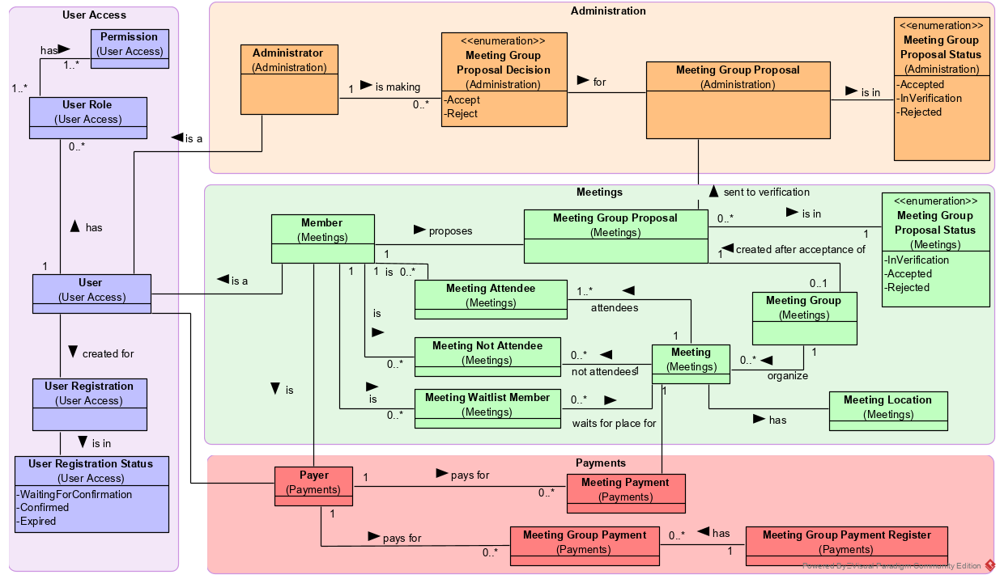

**Conceptual Model of commenting feature**


### 2.3 Event Storming

While a Conceptual Model focuses on structures and relationships between them, **behavior** and **events** that occur in our domain are more important.

There are many ways to show behavior and events. One of them is a light technique called [Event Storming](https://www.eventstorming.com/) which is becoming more popular. Below are presented 3 main business processes using this technique: user registration, meeting group creation and meeting organization.

Note: Event Storming is a light, live workshop. One of the possible outputs of this workshop is presented here. Even if you are not doing Event Storming workshops, this type of process presentation can be very valuable to you and your stakeholders.

**User Registration process**

------

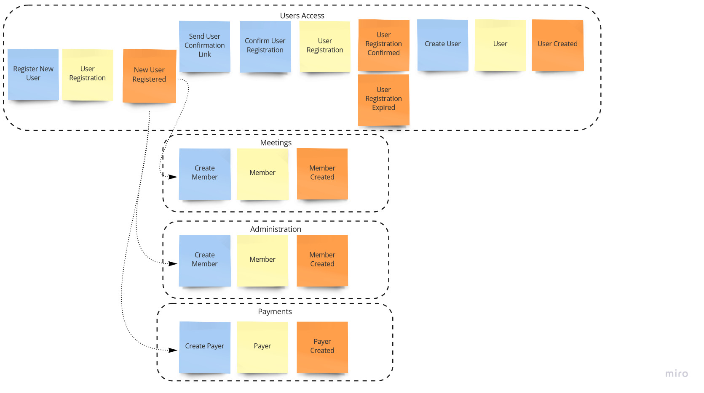

------

**Meeting Group creation**
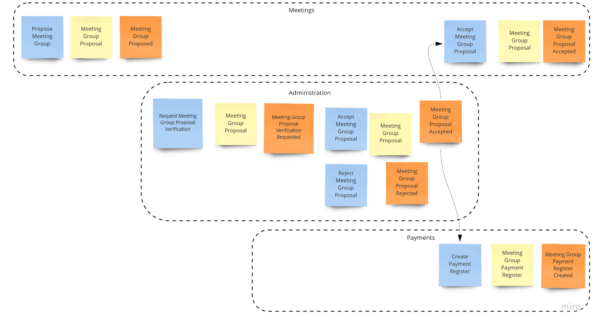

------

**Meeting organization**
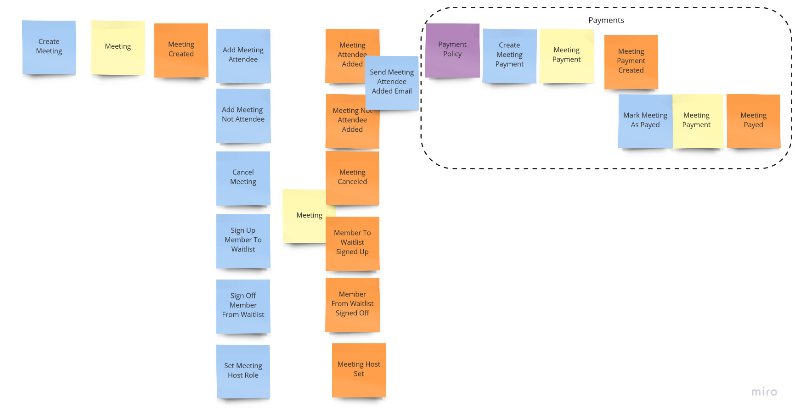

------

**Payments**
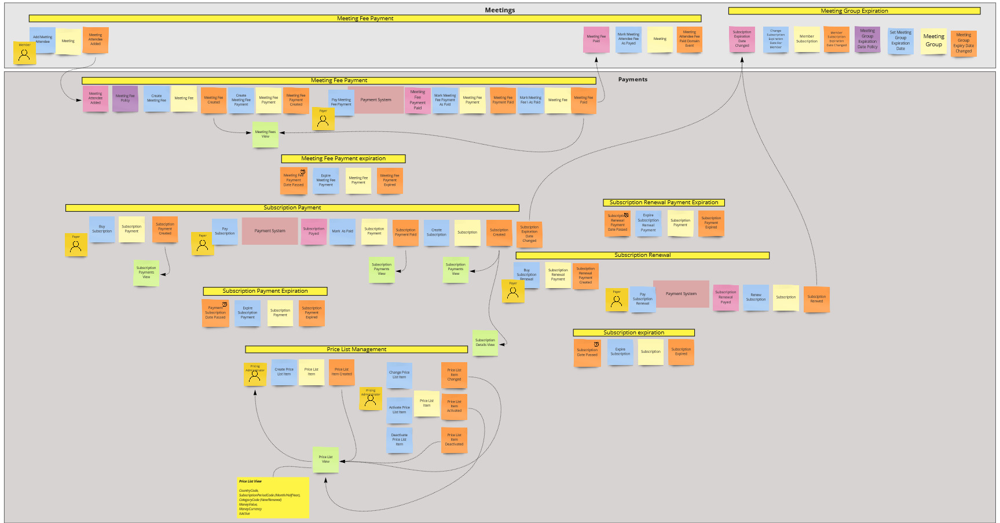
[Download high resolution file](docs/Images/Payments_EventStorming_Design_HighRes.jpg)

------

## 3. Architecture

### 3.0 C4 Model

[C4 model](https://c4model.com/) is a lean graphical notation technique for modelling the architecture of software systems. <br>

As can be found on the website of the author of this model ([Simon Brown](https://simonbrown.je/)): *The C4 model was created as a way to help software development teams describe and communicate software architecture, both during up-front design sessions and when retrospectively documenting an existing codebase* <br>

*Model C4* defines 4 levels (views) of the system architecture: *System Context*, *Container*, *Component* and *Code*. Below are examples of each of these levels that describe the architecture of this system. <br>

*Note: The [PlantUML](https://plantuml.com/) (diagram as text) component was used to describe all C4 model levels. Additionally, for levels C1-C3, a [C4-PlantUML](https://github.com/plantuml-stdlib/C4-PlantUML) plug-in connecting PlantUML with the C4 model was used*.

#### 3.0.1 C1 System Context


#### 3.0.2 C2 Container

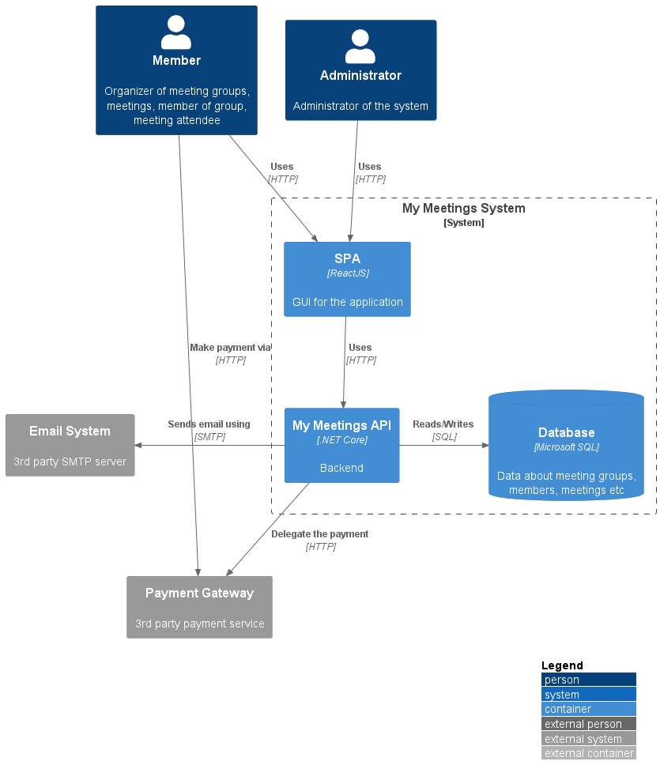

#### 3.0.3 C3 Component (high-level)

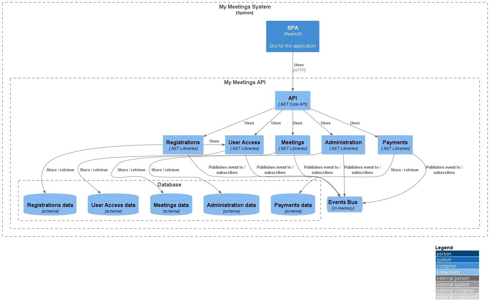

#### 3.0.4 C3 Component (module-level)


#### 3.0.5 C4 Code (meeting group aggregate)


### 3.1 High Level View

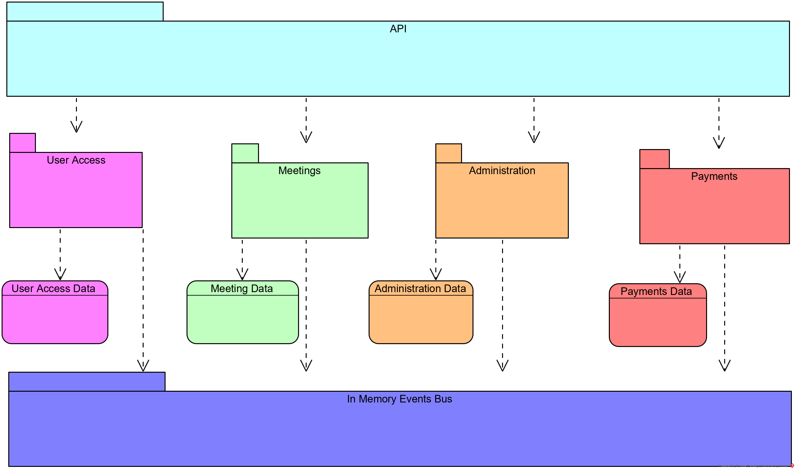

**Module descriptions:**

- **API** - Very thin ASP.NET MVC Core REST API application. Main responsibilities are:
  1. Accept request
  2. Authenticate and authorize request (using User Access module)
  3. Delegate work to specific module sending Command or Query
  4. Return response
- **User Access** - responsible for user authentication and authorization
- **Registrations** - responsible for user registration
- **Meetings** - implements Meetings Bounded Context: creating meeting groups, meetings
- **Administration** - implements Administration Bounded Context: implements administrative tasks like meeting group proposal verification
- **Payments** - implements Payments Bounded Context: implements all functionalities associated with payments
- **In Memory Events Bus** - Publish/Subscribe implementation to asynchronously integrate all modules using events ([Event Driven Architecture](https://en.wikipedia.org/wiki/Event-driven_architecture)).

**Key assumptions:**

1. API contains no application logic
2. API communicates with Modules using a small interface to send Queries and Commands
3. Each Module has its own interface which is used by API
4. **Modules communicate each other only asynchronously using Events Bus** - direct method calls are not allowed
5. Each Module **has it's own data** in a separate schema - shared data is not allowed
   - Module data could be moved into separate databases if desired
6. Modules can only have a dependency on the integration events assembly of other Module (see [Module level view](#32-module-level-view))
7. Each Module has its own [Composition Root](https://freecontent.manning.com/dependency-injection-in-net-2nd-edition-understanding-the-composition-root/), which implies that each Module has its own Inversion-of-Control container
8. API as a host needs to initialize each module and each module has an initialization method
9. Each Module is **highly encapsulated** - only required types and members are public, the rest are internal or private

### 3.2 Module Level View

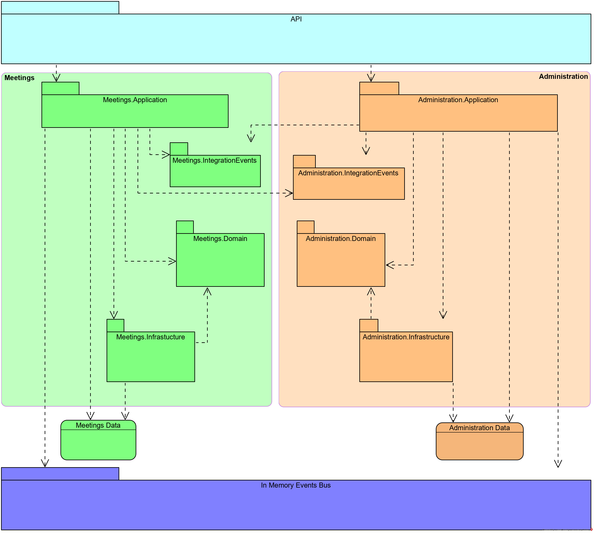

Each Module has [Clean Architecture](https://blog.cleancoder.com/uncle-bob/2012/08/13/the-clean-architecture.html) and consists of the following submodules (assemblies):

- **Application** - the application logic submodule which is responsible for requests processing: use cases, domain events, integration events, internal commands.
- **Domain** - Domain Model in Domain-Driven Design terms implements the applicable [Bounded Context](https://martinfowler.com/bliki/BoundedContext.html)
- **Infrastructure** - infrastructural code responsible for module initialization, background processing, data access, communication with Events Bus and other external components or systems
- **IntegrationEvents** - **Contracts** published to the Events Bus; only this assembly can be called by other modules

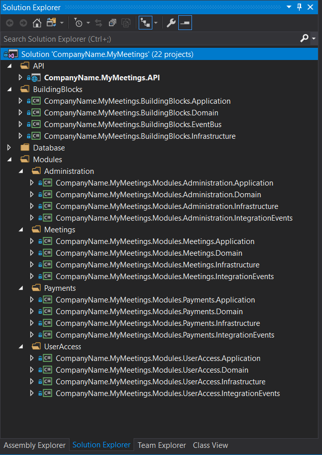

**Note:** Application, Domain and Infrastructure assemblies could be merged into one assembly. Some people like horizontal layering or more decomposition, some don't. Implementing the Domain Model or Infrastructure in separate assembly allows encapsulation using the [`internal`](https://docs.microsoft.com/en-us/dotnet/csharp/language-reference/keywords/internal) keyword. Sometimes Bounded Context logic is not worth it because it is too simple. As always, be pragmatic and take whatever approach you like.

### 3.3 API and Module Communication

The API only communicates with Modules in two ways: during module initialization and request processing.

**Module initialization**

Each module has a static ``Initialize`` method which is invoked in the API ``Startup`` class. All configuration needed by this module should be provided as arguments to this method. All services are configured during initialization and the Composition Root is created using the Inversion-of-Control Container.

```csharp
public static void Initialize(
    string connectionString,
    IExecutionContextAccessor executionContextAccessor,
    ILogger logger,
    EmailsConfiguration emailsConfiguration)
{
    var moduleLogger = logger.ForContext("Module", "Meetings");

    ConfigureCompositionRoot(connectionString, executionContextAccessor, moduleLogger, emailsConfiguration);

    QuartzStartup.Initialize(moduleLogger);

    EventsBusStartup.Initialize(moduleLogger);
}
```

**Request processing**

Each module has the same interface signature exposed to the API. It contains 3 methods: command with result, command without result and query.

```csharp
public interface IMeetingsModule
{
    Task<TResult> ExecuteCommandAsync<TResult>(ICommand<TResult> command);

    Task ExecuteCommandAsync(ICommand command);

    Task<TResult> ExecuteQueryAsync<TResult>(IQuery<TResult> query);
}
```

**Note:** Some people say that processing a command should not return a result. This is an understandable approach but sometimes impractical, especially when you want to immediately return the ID of a newly created resource. Sometimes the boundary between Command and Query is blurry. One example is ``AuthenticateCommand`` - it returns a token but it is not a query because it has a side effect.

### 3.4 Module Requests Processing via CQRS

Processing of Commands and Queries is separated by applying the architectural style/pattern [Command Query Responsibility Segregation (CQRS)](https://docs.microsoft.com/en-us/azure/architecture/patterns/cqrs).


Commands are processed using *Write Model* which is implemented using DDD tactical patterns:

```csharp
internal class CreateNewMeetingGroupCommandHandler : ICommandHandler<CreateNewMeetingGroupCommand>
{
    private readonly IMeetingGroupRepository _meetingGroupRepository;
    private readonly IMeetingGroupProposalRepository _meetingGroupProposalRepository;

    internal CreateNewMeetingGroupCommandHandler(
        IMeetingGroupRepository meetingGroupRepository,
        IMeetingGroupProposalRepository meetingGroupProposalRepository)
    {
        _meetingGroupRepository = meetingGroupRepository;
        _meetingGroupProposalRepository = meetingGroupProposalRepository;
    }

    public async Task Handle(CreateNewMeetingGroupCommand request, CancellationToken cancellationToken)
    {
        var meetingGroupProposal = await _meetingGroupProposalRepository.GetByIdAsync(request.MeetingGroupProposalId);

        var meetingGroup = meetingGroupProposal.CreateMeetingGroup();

        await _meetingGroupRepository.AddAsync(meetingGroup);

        
    }
}
```

Queries are processed using *Read Model* which is implemented by executing raw SQL statements on database views:

```csharp
internal class GetAllMeetingGroupsQueryHandler : IQueryHandler<GetAllMeetingGroupsQuery, List<MeetingGroupDto>>
{
    private readonly ISqlConnectionFactory _sqlConnectionFactory;

    internal GetAllMeetingGroupsQueryHandler(ISqlConnectionFactory sqlConnectionFactory)
    {
        _sqlConnectionFactory = sqlConnectionFactory;
    }

    public async Task<List<MeetingGroupDto>> Handle(GetAllMeetingGroupsQuery request, CancellationToken cancellationToken)
    {
        var connection = _sqlConnectionFactory.GetOpenConnection();

        const string sql = $"""
                           SELECT 
                                [MeetingGroup].[Id] as [{nameof(MeetingGroupDto.Id)}] , 
                                [MeetingGroup].[Name] as [{nameof(MeetingGroupDto.Name)}], 
                                [MeetingGroup].[Description] as [{nameof(MeetingGroupDto.Description)}] 
                                [MeetingGroup].[LocationCountryCode] as [{nameof(MeetingGroupDto.LocationCountryCode)}],
                                [MeetingGroup].[LocationCity] as [{nameof(MeetingGroupDto.LocationCity)}]
                           FROM [meetings].[v_MeetingGroups] AS [MeetingGroup]
                           """;
        var meetingGroups = await connection.QueryAsync<MeetingGroupDto>(sql);

        return meetingGroups.AsList();
    }
}
```

**Key advantages:**

- Solution is appropriate to the problem - reading and writing needs are usually different
- Supports [Single Responsibility Principle](https://en.wikipedia.org/wiki/Single_responsibility_principle) (SRP) - one handler does one thing
- Supports [Interface Segregation Principle](https://en.wikipedia.org/wiki/Interface_segregation_principle) (ISP) - each handler implements interface with exactly one method
- Supports [Parameter Object pattern](https://refactoring.com/catalog/introduceParameterObject.html) - Commands and Queries are objects which are easy to serialize/deserialize
- Easy way to apply [Decorator pattern](https://en.wikipedia.org/wiki/Decorator_pattern) to handle cross-cutting concerns
- Supports Loose Coupling by use of the [Mediator pattern](https://en.wikipedia.org/wiki/Mediator_pattern) - separates invoker of request from handler of request

**Disadvantage:**

- Mediator pattern introduces extra indirection and is harder to reason about which class handles the request

For more information: [Simple CQRS implementation with raw SQL and DDD](https://www.kamilgrzybek.com/design/simple-cqrs-implementation-with-raw-sql-and-ddd/)

### 3.5 Domain Model Principles and Attributes

The Domain Model, which is the central and most critical part in the system, should be designed with special attention. Here are some key principles and attributes which are applied to Domain Models of each module:

1. **High level of encapsulation**

    All members are ``private`` by default, then ``internal`` - only ``public`` at the very edge.

2. **High level of PI (Persistence Ignorance)**

    No dependencies to infrastructure, databases, etc. All classes are [POCOs](https://en.wikipedia.org/wiki/Plain_old_CLR_object).

3. **Rich in behavior**

    All business logic is located in the Domain Model. No leaks to the application layer or elsewhere.

4. **Low level of Primitive Obsession**

    Primitive attributes of Entites grouped together using ValueObjects.

5. **Business language**

    All classes, methods and other members are named in business language used in this Bounded Context.

6. **Testable**

    The Domain Model is a critical part of the system so it should be easy to test (Testable Design).

```csharp
public class MeetingGroup : Entity, IAggregateRoot
{
    public MeetingGroupId Id { get; private set; }

    private string _name;

    private string _description;

    private MeetingGroupLocation _location;

    private MemberId _creatorId;

    private List<MeetingGroupMember> _members;

    private DateTime _createDate;

    private DateTime? _paymentDateTo;

    internal static MeetingGroup CreateBasedOnProposal(
        MeetingGroupProposalId meetingGroupProposalId,
        string name,
        string description,
        MeetingGroupLocation location, MemberId creatorId)
    {
        return new MeetingGroup(meetingGroupProposalId, name, description, location, creatorId);
    }

     public Meeting CreateMeeting(
            string title,
            MeetingTerm term,
            string description,
            MeetingLocation location,
            int? attendeesLimit,
            int guestsLimit,
            Term rsvpTerm,
            MoneyValue eventFee,
            List<MemberId> hostsMembersIds,
            MemberId creatorId)
        {
            this.CheckRule(new MeetingCanBeOrganizedOnlyByPayedGroupRule(_paymentDateTo));

            this.CheckRule(new MeetingHostMustBeAMeetingGroupMemberRule(creatorId, hostsMembersIds, _members));

            return new Meeting(this.Id,
                title,
                term,
                description,
                location,
                attendeesLimit,
                guestsLimit,
                rsvpTerm,
                eventFee,
                hostsMembersIds,
                creatorId);
        }
```

### 3.6 Cross-Cutting Concerns

To support [Single Responsibility Principle](https://en.wikipedia.org/wiki/Single_responsibility_principle) and [Don't Repeat Yourself](https://en.wikipedia.org/wiki/Don%27t_repeat_yourself) principles, the implementation of cross-cutting concerns is done using the [Decorator Pattern](https://en.wikipedia.org/wiki/Decorator_pattern). Each Command processor is decorated by 3 decorators: logging, validation and unit of work.

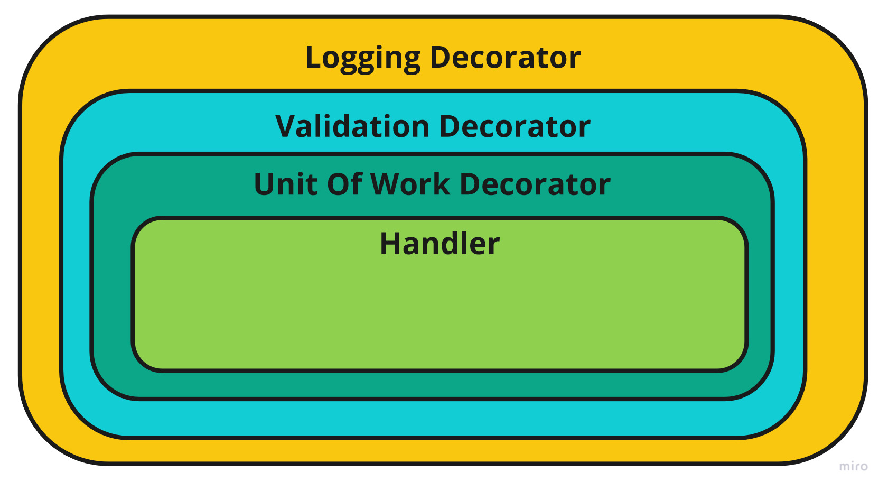

**Logging**

The Logging decorator logs execution, arguments and processing of each Command. This way each log inside a processor has the log context of the processing command.

```csharp
internal class LoggingCommandHandlerDecorator<T> : ICommandHandler<T> where T:ICommand
{
    private readonly ILogger _logger;
    private readonly IExecutionContextAccessor _executionContextAccessor;
    private readonly ICommandHandler<T> _decorated;

    public LoggingCommandHandlerDecorator(
        ILogger logger,
        IExecutionContextAccessor executionContextAccessor,
        ICommandHandler<T> decorated)
    {
        _logger = logger;
        _executionContextAccessor = executionContextAccessor;
        _decorated = decorated;
    }
    public async Task Handle(T command, CancellationToken cancellationToken)
    {
        if (command is IRecurringCommand)
        {
            return await _decorated.Handle(command, cancellationToken);
        }
        using (
            LogContext.Push(
                new RequestLogEnricher(_executionContextAccessor),
                new CommandLogEnricher(command)))
        {
            try
            {
                this._logger.Information(
                    "Executing command {Command}",
                    command.GetType().Name);

                var result = await _decorated.Handle(command, cancellationToken);

                this._logger.Information("Command {Command} processed successful", command.GetType().Name);

                return result;
            }
            catch (Exception exception)
            {
                this._logger.Error(exception, "Command {Command} processing failed", command.GetType().Name);
                throw;
            }
        }
    }

    private class CommandLogEnricher : ILogEventEnricher
    {
        private readonly ICommand _command;

        public CommandLogEnricher(ICommand command)
        {
            _command = command;
        }
        public void Enrich(LogEvent logEvent, ILogEventPropertyFactory propertyFactory)
        {
            logEvent.AddOrUpdateProperty(new LogEventProperty("Context", new ScalarValue($"Command:{_command.Id.ToString()}")));
        }
    }

    private class RequestLogEnricher : ILogEventEnricher
    {
        private readonly IExecutionContextAccessor _executionContextAccessor;
        public RequestLogEnricher(IExecutionContextAccessor executionContextAccessor)
        {
            _executionContextAccessor = executionContextAccessor;
        }
        public void Enrich(LogEvent logEvent, ILogEventPropertyFactory propertyFactory)
        {
            if (_executionContextAccessor.IsAvailable)
            {
                logEvent.AddOrUpdateProperty(new LogEventProperty("CorrelationId", new ScalarValue(_executionContextAccessor.CorrelationId)));
            }
        }
    }
}
```

**Validation**

The Validation decorator performs Command data validation. It checks rules against Command arguments using the FluentValidation library.

```csharp
internal class ValidationCommandHandlerDecorator<T> : ICommandHandler<T> where T:ICommand
{
    private readonly IList<IValidator<T>> _validators;
    private readonly ICommandHandler<T> _decorated;

    public ValidationCommandHandlerDecorator(
        IList<IValidator<T>> validators,
        ICommandHandler<T> decorated)
    {
        this._validators = validators;
        _decorated = decorated;
    }

    public Task<Unit> Handle(T command, CancellationToken cancellationToken)
    {
        var errors = _validators
            .Select(v => v.Validate(command))
            .SelectMany(result => result.Errors)
            .Where(error => error != null)
            .ToList();

        if (errors.Any())
        {
            var errorBuilder = new StringBuilder();

            errorBuilder.AppendLine("Invalid command, reason: ");

            foreach (var error in errors)
            {
                errorBuilder.AppendLine(error.ErrorMessage);
            }

            throw new InvalidCommandException(errorBuilder.ToString(), null);
        }

        return _decorated.Handle(command, cancellationToken);
    }
}
```

**Unit Of Work**

All Command processing has side effects. To avoid calling commit on every handler, `UnitOfWorkCommandHandlerDecorator` is used. It additionally marks `InternalCommand` as processed (if it is Internal Command) and dispatches all Domain Events (as part of [Unit Of Work](https://martinfowler.com/eaaCatalog/unitOfWork.html)).

```csharp
public class UnitOfWorkCommandHandlerDecorator<T> : ICommandHandler<T> where T:ICommand
{
    private readonly ICommandHandler<T> _decorated;
    private readonly IUnitOfWork _unitOfWork;
    private readonly MeetingsContext _meetingContext;

    public UnitOfWorkCommandHandlerDecorator(
        ICommandHandler<T> decorated,
        IUnitOfWork unitOfWork,
        MeetingsContext meetingContext)
    {
        _decorated = decorated;
        _unitOfWork = unitOfWork;
        _meetingContext = meetingContext;
    }

    public async Task Handle(T command, CancellationToken cancellationToken)
    {
        await this._decorated.Handle(command, cancellationToken);

        if (command is InternalCommandBase)
        {
            var internalCommand =
                await _meetingContext.InternalCommands.FirstOrDefaultAsync(x => x.Id == command.Id,
                    cancellationToken: cancellationToken);

            if (internalCommand != null)
            {
                internalCommand.ProcessedDate = DateTime.UtcNow;
            }
        }

        await this._unitOfWork.CommitAsync(cancellationToken);

        
    }
}
```

### 3.7 Modules Integration

Integration between modules is strictly **asynchronous** using Integration Events and the In Memory Event Bus as broker. In this way coupling between modules is minimal and exists only on the structure of Integration Events.

**Modules don't share data** so it is not possible nor desirable to create a transaction which spans more than one module. To ensure maximum reliability, the [Outbox / Inbox pattern](http://www.kamilgrzybek.com/design/the-outbox-pattern/) is used. This pattern provides accordingly *"At-Least-Once delivery"* and *"At-Least-Once processing"*.

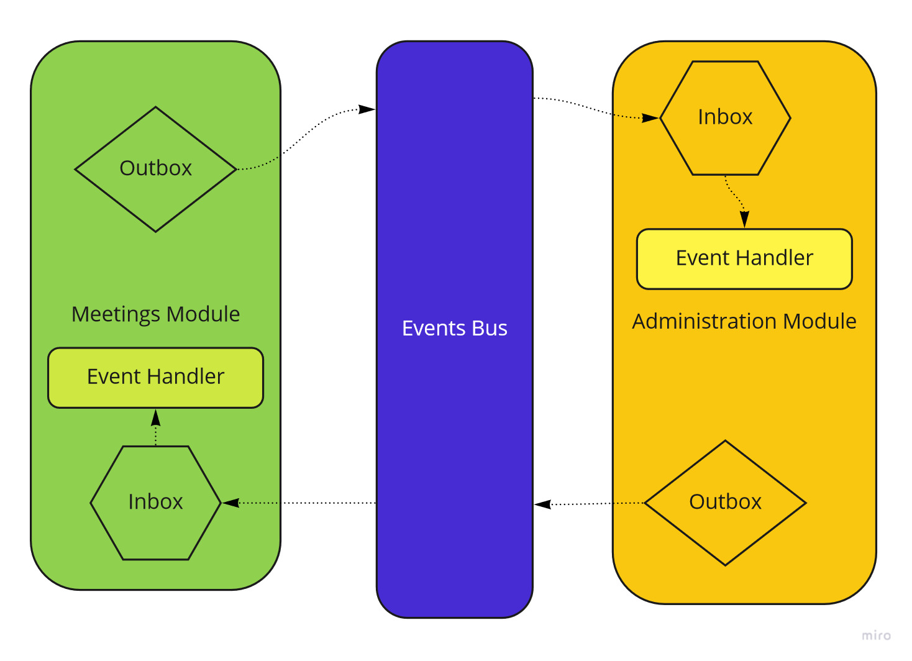

The Outbox and Inbox is implemented using two SQL tables and a background worker for each module. The background worker is implemented using the Quartz.NET library.

**Saving to Outbox:**

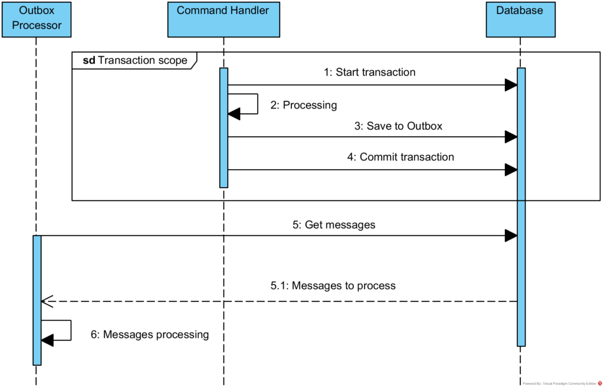

**Processing Outbox:**

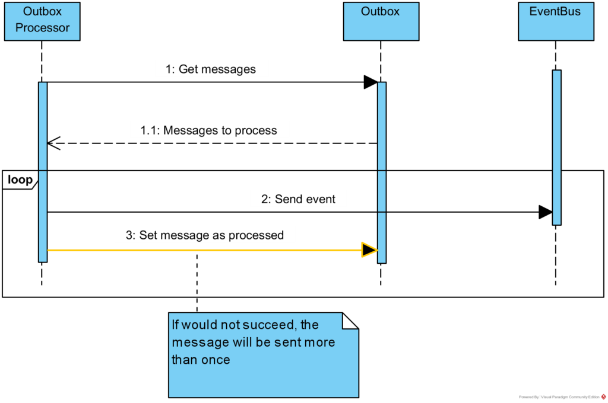

### 3.8 Internal Processing

The main principle of this system is that you can change its state only by calling a specific Command.

Commands can be called not only by the API, but by the processing module itself. The main use case which implements this mechanism is data processing in eventual consistency mode when we want to process something in a different process and transaction. This applies, for example, to Inbox processing because we want to do something (calling a Command) based on an Integration Event from the Inbox.

This idea is taken from Alberto's Brandolini's Event Storming picture called "The picture that explains “almost” everything" which shows that every side effect (domain event) is created by invoking a Command on Aggregate. See [EventStorming cheat sheet](https://xebia.com/blog/eventstorming-cheat-sheet/) article for more details.

Implementation of internal processing is very similar to implementation of the Outbox and Inbox. One SQL table and one background worker for processing. Each internally processing Command must inherit from `InternalCommandBase` class:

```csharp
internal abstract class InternalCommandBase : ICommand
{
    public Guid Id { get; }

    protected InternalCommandBase(Guid id)
    {
        this.Id = id;
    }
}
```

This is important because the `UnitOfWorkCommandHandlerDecorator` must mark an internal Command as processed during committing:

```csharp
public async Task Handle(T command, CancellationToken cancellationToken)
{
    await this._decorated.Handle(command, cancellationToken);

    if (command is InternalCommandBase)
    {
        var internalCommand =
            await _meetingContext.InternalCommands.FirstOrDefaultAsync(x => x.Id == command.Id,
                cancellationToken: cancellationToken);

        if (internalCommand != null)
        {
            internalCommand.ProcessedDate = DateTime.UtcNow;
        }
    }

    await this._unitOfWork.CommitAsync(cancellationToken);

    
}
```

### 3.9 Security

**Authentication**

Authentication is implemented using JWT Token and Bearer scheme using IdentityServer. For now, only one authentication method is implemented: forms style authentication (username and password) via the OAuth2 [Resource Owner Password Grant Type](https://www.oauth.com/oauth2-servers/access-tokens/password-grant/). It requires implementation of the `IResourceOwnerPasswordValidator` interface:

```csharp
public class ResourceOwnerPasswordValidator : IResourceOwnerPasswordValidator
{
    private readonly IUserAccessModule _userAccessModule;

    public ResourceOwnerPasswordValidator(IUserAccessModule userAccessModule)
    {
        _userAccessModule = userAccessModule;
    }

    public async Task ValidateAsync(ResourceOwnerPasswordValidationContext context)
    {
        var authenticationResult = await _userAccessModule.ExecuteCommandAsync(new AuthenticateCommand(context.UserName, context.Password));
        if (!authenticationResult.IsAuthenticated)
        {
            context.Result = new GrantValidationResult(
                TokenRequestErrors.InvalidGrant,
                authenticationResult.AuthenticationError);
            return;
        }
        context.Result = new GrantValidationResult(
            authenticationResult.User.Id.ToString(),
            "forms",
            authenticationResult.User.Claims);
    }
}
```

**Authorization**

Authorization is achieved by implementing [RBAC (Role Based Access Control)](https://en.wikipedia.org/wiki/Role-based_access_control) using Permissions. Permissions are more granular and a much better way to secure your application than Roles alone. Each User has a set of Roles and each Role contains one or more Permission. The User's set of Permissions is extracted from all Roles the User belongs to. Permissions are always checked on `Controller` level - never Roles:

```csharp
[HttpPost]
[Route("")]
[HasPermission(MeetingsPermissions.ProposeMeetingGroup)]
public async Task<IActionResult> ProposeMeetingGroup(ProposeMeetingGroupRequest request)
{
    await _meetingsModule.ExecuteCommandAsync(
        new ProposeMeetingGroupCommand(
            request.Name,
            request.Description,
            request.LocationCity,
            request.LocationCountryCode));

    return Ok();
}
```

### 3.10 Unit Tests

**Definition:**

>A unit test is an automated piece of code that invokes the unit of work being tested, and then checks some assumptions about a single end result of that unit. A unit test is almost always written using a unit testing framework. It can be written easily and runs quickly. It’s trustworthy, readable, and maintainable. It’s consistent in its results as long as production code hasn’t changed. [Art of Unit Testing 2nd Edition](https://www.manning.com/books/the-art-of-unit-testing-second-edition) Roy Osherove

**Attributes of good unit test**

- Automated
- Maintainable
- Runs very fast (in ms)
- Consistent, Deterministic (always the same result)
- Isolated from other tests
- Readable
- Can be executed by anyone
- Testing public API, not internal behavior (overspecification)
- Looks like production code
- Treated as production code

**Implementation**

Unit tests should mainly test business logic (domain model): </br>
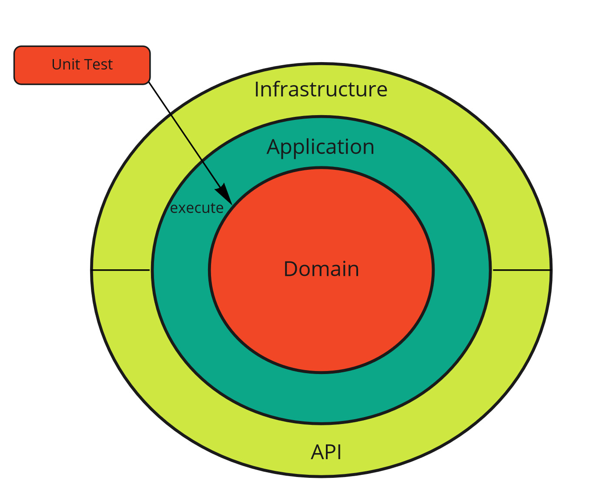

Each unit test has 3 standard sections: Arrange, Act and Assert:

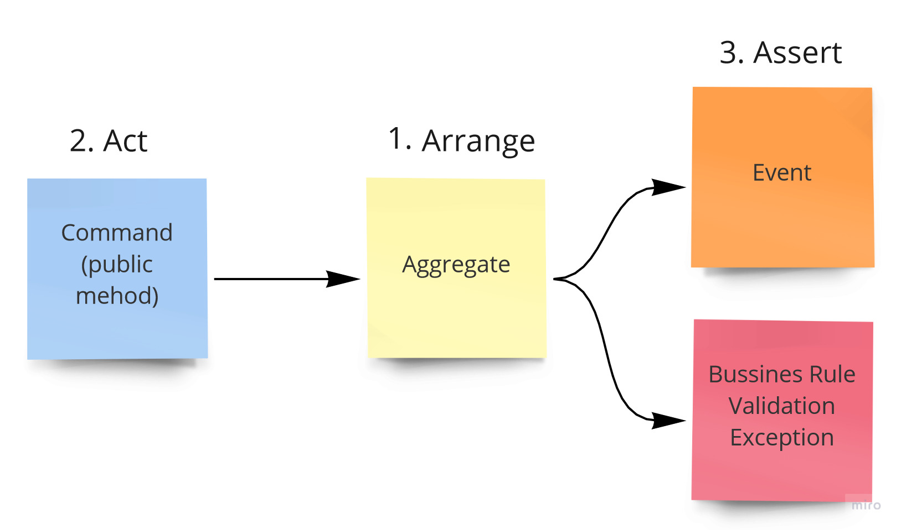

**1\. Arrange**

The Arrange section is responsible for preparing the Aggregate for testing the public method that we want to test. This public method is often called (from the unit tests perspective) the SUT (system under test).

Creating an Aggregate ready for testing involves **calling one or more other public constructors/methods** on the Domain Model. At first it may seem that we are testing too many things at the same time, but this is not true. We need to be one hundred percent sure that the Aggregate is in a state exactly as it will be in production. This can only be ensured when we:

- **Use only public API of Domain Model**
- Don't use [InternalsVisibleToAttribute](https://docs.microsoft.com/en-us/dotnet/api/system.runtime.compilerservices.internalsvisibletoattribute?view=netframework-4.8) class
  - This exposes the Domain Model to the Unit Tests library, removing encapsulation so our tests and production code are treated differently and it is a very bad thing
- Don't use [ConditionalAttribute](https://docs.microsoft.com/en-us/dotnet/api/system.diagnostics.conditionalattribute?view=netframework-4.8) classes - it reduces readability and increases complexity
- Don't create any special constructors/factory methods for tests (even with conditional compilation symbols)
  - Special constructor/factory method only for unit tests causes duplication of business logic in the test itself and focuses on state - this kind of approach causes the test to be very sensitive to changes and hard to maintain
- Don't remove encapsulation from Domain Model (for example: change keywords from `internal`/`private` to `public`)
- Don't make methods `protected` to inherit from tested class and in this way provide access to internal methods/properties

**Isolation of external dependencies**

There are 2 main concepts - stubs and mocks:

> A stub is a controllable replacement for an existing dependency (or collaborator) in the system. By using a stub, you can test your code without dealing with the dependency directly.

>A mock object is a fake object in the system that decides whether the unit test has passed or failed. It does so by verifying whether the object under test called the fake object as expected. There’s usually no more than one mock per test.
>[Art of Unit Testing 2nd Edition](https://www.manning.com/books/the-art-of-unit-testing-second-edition) Roy Osherove

Good advice: use stubs if you need to, but try to avoid mocks. Mocking causes us to test too many internal things and leads to overspecification.

**2\. Act**

This section is very easy - we execute **exactly one** public method on aggregate (SUT).

**3\. Assert**

In this section we check expectations. There are only 2 possible outcomes:

- Method completed and Domain Event(s) published
- Business rule was broken

Simple example:

```csharp
[Test]
public void NewUserRegistration_WithUniqueLogin_IsSuccessful()
{
    // Arrange
    var usersCounter = Substitute.For<IUsersCounter>();

    // Act
    var userRegistration =
        UserRegistration.RegisterNewUser(
            "login", "password", "test@email",
            "firstName", "lastName", usersCounter);

    // Assert
    var newUserRegisteredDomainEvent = AssertPublishedDomainEvent<NewUserRegisteredDomainEvent>(userRegistration);
    Assert.That(newUserRegisteredDomainEvent.UserRegistrationId, Is.EqualTo(userRegistration.Id));
}

[Test]
public void NewUserRegistration_WithoutUniqueLogin_BreaksUserLoginMustBeUniqueRule()
{
    // Arrange
    var usersCounter = Substitute.For<IUsersCounter>();
    usersCounter.CountUsersWithLogin("login").Returns(x => 1);

    // Assert
    AssertBrokenRule<UserLoginMustBeUniqueRule>(() =>
    {
        // Act
        UserRegistration.RegisterNewUser(
            "login", "password", "test@email",
            "firstName", "lastName", usersCounter);
    });
}
```

Advanced example:

```csharp
[Test]
public void AddAttendee_WhenMemberIsAlreadyAttendeeOfMeeting_IsNotPossible()
{
    // Arrange
    var creatorId = new MemberId(Guid.NewGuid());
    var meetingTestData = CreateMeetingTestData(new MeetingTestDataOptions
    {
        CreatorId = creatorId
    });
    var newMemberId = new MemberId(Guid.NewGuid());
    meetingTestData.MeetingGroup.JoinToGroupMember(newMemberId);
    meetingTestData.Meeting.AddAttendee(meetingTestData.MeetingGroup, newMemberId, 0);

    // Assert
    AssertBrokenRule<MemberCannotBeAnAttendeeOfMeetingMoreThanOnceRule>(() =>
    {
        // Act
        meetingTestData.Meeting.AddAttendee(meetingTestData.MeetingGroup, newMemberId, 0);
    });
}
```

`CreateMeetingTestData` method is an implementation of [SUT Factory](https://blog.ploeh.dk/2009/02/13/SUTFactory/) described by Mark Seemann which allows keeping common creation logic in one place:

```csharp
protected MeetingTestData CreateMeetingTestData(MeetingTestDataOptions options)
{
    var proposalMemberId = options.CreatorId ?? new MemberId(Guid.NewGuid());
    var meetingProposal = MeetingGroupProposal.ProposeNew(
        "name", "description",
        new MeetingGroupLocation("Warsaw", "PL"), proposalMemberId);

    meetingProposal.Accept();

    var meetingGroup = meetingProposal.CreateMeetingGroup();

    meetingGroup.UpdatePaymentInfo(DateTime.Now.AddDays(1));

    var meetingTerm = options.MeetingTerm ??
                      new MeetingTerm(DateTime.UtcNow.AddDays(1), DateTime.UtcNow.AddDays(2));

    var rsvpTerm = options.RvspTerm ?? Term.NoTerm;
    var meeting = meetingGroup.CreateMeeting("title",
        meetingTerm,
        "description",
        new MeetingLocation("Name", "Address", "PostalCode", "City"),
        options.AttendeesLimit,
        options.GuestsLimit,
        rsvpTerm,
        MoneyValue.Zero,
        new List<MemberId>(),
        proposalMemberId);

    DomainEventsTestHelper.ClearAllDomainEvents(meetingGroup);

    return new MeetingTestData(meetingGroup, meeting);
}
```

### 3.11 Architecture Decision Log

All Architectural Decisions (AD) are documented in the [Architecture Decision Log (ADL)](docs/architecture-decision-log).

More information about documenting architecture-related decisions in this way : [https://github.com/joelparkerhenderson/architecture_decision_record](https://github.com/joelparkerhenderson/architecture_decision_record)

### 3.12 Architecture Unit Tests

In some cases it is not possible to enforce the application architecture, design or established conventions using compiler (compile-time). For this reason, code implementations can diverge from the original design and architecture. We want to minimize this behavior, not only by code review.</br>

To do this, unit tests of system architecture, design, major conventions and assumptions  have been written. In .NET there is special library for this task: [NetArchTest](https://github.com/BenMorris/NetArchTest). This library has been written based on the very popular JAVA architecture unit tests library - [ArchUnit](https://www.archunit.org/).</br>

Using this kind of tests we can test proper layering of our application, dependencies, encapsulation, immutability, DDD correct implementation, naming, conventions and so on - everything what we need to test. Example:</br>

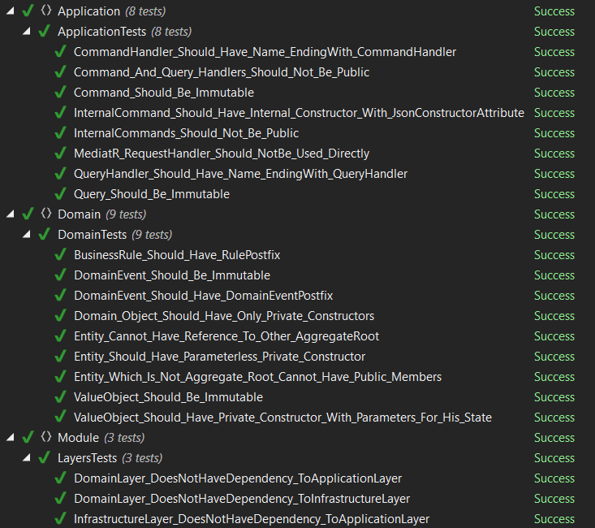

More information about architecture unit tests here: [https://blogs.oracle.com/javamagazine/unit-test-your-architecture-with-archunit](https://blogs.oracle.com/javamagazine/unit-test-your-architecture-with-archunit)

### 3.13 Integration Tests

#### Definition

"Integration Test" term is blurred. It can mean test between classes, modules, services, even systems - see [this](https://martinfowler.com/bliki/IntegrationTest.html) article (by Martin Fowler). </br>

For this reason, the definition of integration test in this project is as follows:</br>

- it verifies how system works in integration with "out-of-process" dependencies - database, messaging system, file system or external API
- it tests particular use case
- it can be slow (as opposed to Unit Test)

#### Approach

- **Do not mock dependencies over which you have full control** (like database). Full control dependency means you can always revert all changes (remove side-effects) and no one can notice it. They are not visible to others. See next point, please.
- **Use "production", normal, real database version**. Some use e.g. in memory repository, some use light databases instead "production" version. This is still mocking. Testing makes sense if we have full confidence in testing. You can't trust the test if you know that the infrastructure in the production environment will vary. Be always as close to production environment as possible.
- **Mock dependencies over which you don't have control**. No control dependency means you can't remove side-effects after interaction with this dependency (external API, messaging system, SMTP server etc.). They can be visible to others.

#### Implementation

Integration test should test exactly one use case. One use case is represented by one Command/Query processing so CommandHandler/QueryHandler in Application layer is perfect starting point for running the Integration Test:</br>

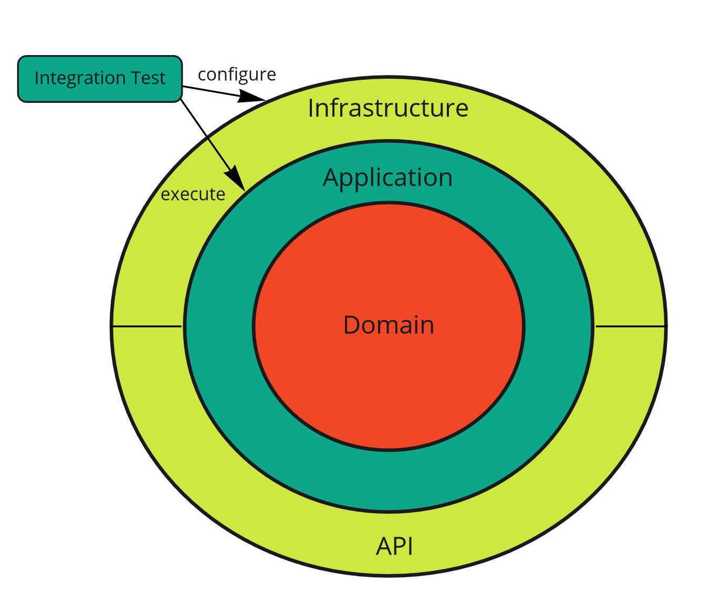
For each test, the following preparation steps must be performed:</br>

1. Clear database
2. Prepare mocks
3. Initialize testing module

```csharp
[SetUp]
public async Task BeforeEachTest()
{
    const string connectionStringEnvironmentVariable =
        "ASPNETCORE_MyMeetings_IntegrationTests_ConnectionString";
    ConnectionString = Environment.GetEnvironmentVariable(connectionStringEnvironmentVariable, EnvironmentVariableTarget.Machine);
    if (ConnectionString == null)
    {
        throw new ApplicationException(
            $"Define connection string to integration tests database using environment variable: {connectionStringEnvironmentVariable}");
    }

    using (var sqlConnection = new SqlConnection(ConnectionString))
    {
        await ClearDatabase(sqlConnection);
    }

    Logger = Substitute.For<ILogger>();
    EmailSender = Substitute.For<IEmailSender>();
    EventsBus = new EventsBusMock();
    ExecutionContext = new ExecutionContextMock(Guid.NewGuid());
    
    PaymentsStartup.Initialize(
        ConnectionString,
        ExecutionContext,
        Logger,
        EventsBus,
        false);

    PaymentsModule = new PaymentsModule();
}
```

After preparation, test is performed on clear database. Usually, it is the execution of some (or many) Commands and: </br>
a) running a Query or/and  </br>
b) verifying mocks </br>
to check the result.

```csharp
[TestFixture]
public class MeetingPaymentTests : TestBase
{
    [Test]
    public async Task CreateMeetingPayment_Test()
    {
        PayerId payerId = new PayerId(Guid.NewGuid());
        MeetingId meetingId = new MeetingId(Guid.NewGuid());
        decimal value = 100;
        string currency = "EUR";
        await PaymentsModule.ExecuteCommandAsync(new CreateMeetingPaymentCommand(Guid.NewGuid(),
            payerId, meetingId, value, currency));

        var payment = await PaymentsModule.ExecuteQueryAsync(new GetMeetingPaymentQuery(meetingId.Value, payerId.Value));

        Assert.That(payment.PayerId, Is.EqualTo(payerId.Value));
        Assert.That(payment.MeetingId, Is.EqualTo(meetingId.Value));
        Assert.That(payment.FeeValue, Is.EqualTo(value));
        Assert.That(payment.FeeCurrency, Is.EqualTo(currency));
    }
}
```

Each Command/Query processing is a separate execution (with different object graph resolution, context, database connection etc.) thanks to Composition Root of each module. This behavior is important and desirable.

### 3.14 System Integration Testing

#### Definition

[System Integration Testing (SIT)](https://en.wikipedia.org/wiki/System_integration_testing) is performed to verify the interactions between the modules of a software system. It involves the overall testing of a complete system of many subsystem components or elements.

#### Implementation

Implementation of system integration tests is based on approach of integration testing of modules in isolation (invoking commands and queries) described in the previous section.

The problem is that in this case we are dealing with **asynchronous communication**. Due to asynchrony, our **test must wait for the result** at certain times.

To correctly implement such tests, the **Sampling** technique and implementation described in the [Growing Object-Oriented Software, Guided by Tests](https://www.amazon.com/Growing-Object-Oriented-Software-Guided-Tests/dp/0321503627) book was used:

>An asynchronous test must wait for success and use timeouts to detect failure. This implies that every tested activity must have an observable effect: a test must affect the system so that its observable state becomes different. This sounds obvious but it drives how we think about writing asynchronous tests. If an activity has no observable effect, there is nothing the test can wait for, and therefore no way for the test to synchronize with the system it is testing. There are two ways a test can observe the system: by sampling its observable state or by listening for events that it sends out.

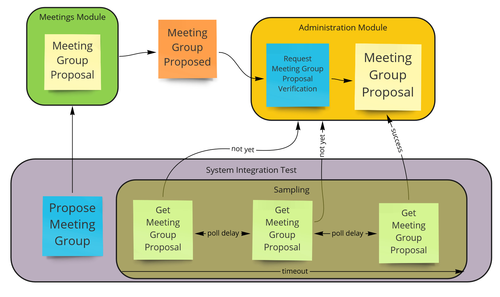

Test below:

1. Creates Meeting Group Proposal in Meetings module
2. Waits until Meeting Group Proposal to verification will be available in Administration module with 10 seconds timeout
3. Accepts Meeting Group Proposal in Administration module
4. Waits until Meeting Group is created in Meetings module with 15 seconds timeout

```csharp
public class CreateMeetingGroupTests : TestBase
{
    [Test]
    public async Task CreateMeetingGroupScenario_WhenProposalIsAccepted()
    {
        var meetingGroupId = await MeetingsModule.ExecuteCommandAsync(
            new ProposeMeetingGroupCommand("Name",
            "Description",
            "Location",
            "PL"));

        AssertEventually(
            new GetMeetingGroupProposalFromAdministrationProbe(meetingGroupId, AdministrationModule), 
            10000);

        await AdministrationModule.ExecuteCommandAsync(new AcceptMeetingGroupProposalCommand(meetingGroupId));

        AssertEventually(
            new GetCreatedMeetingGroupFromMeetingsProbe(meetingGroupId, MeetingsModule),
            15000);
    }

    private class GetCreatedMeetingGroupFromMeetingsProbe : IProbe
    {
        private readonly Guid _expectedMeetingGroupId;

        private readonly IMeetingsModule _meetingsModule;

        private List<MeetingGroupDto> _allMeetingGroups;

        public GetCreatedMeetingGroupFromMeetingsProbe(
            Guid expectedMeetingGroupId, 
            IMeetingsModule meetingsModule)
        {
            _expectedMeetingGroupId = expectedMeetingGroupId;
            _meetingsModule = meetingsModule;
        }

        public bool IsSatisfied()
        {
            return _allMeetingGroups != null && 
                   _allMeetingGroups.Any(x => x.Id == _expectedMeetingGroupId);
        }

        public async Task SampleAsync()
        {
            _allMeetingGroups = await _meetingsModule.ExecuteQueryAsync(new GetAllMeetingGroupsQuery());
        }

        public string DescribeFailureTo() 
            => $"Meeting group with ID: {_expectedMeetingGroupId} is not created";
    }

    private class GetMeetingGroupProposalFromAdministrationProbe : IProbe
    {
        private readonly Guid _expectedMeetingGroupProposalId;

        private MeetingGroupProposalDto _meetingGroupProposal;

        private readonly IAdministrationModule _administrationModule;

        public GetMeetingGroupProposalFromAdministrationProbe(Guid expectedMeetingGroupProposalId, IAdministrationModule administrationModule)
        {
            _expectedMeetingGroupProposalId = expectedMeetingGroupProposalId;
            _administrationModule = administrationModule;
        }

        public bool IsSatisfied()
        {
            if (_meetingGroupProposal == null)
            {
                return false;
            }

            if (_meetingGroupProposal.Id == _expectedMeetingGroupProposalId &&
                _meetingGroupProposal.StatusCode == MeetingGroupProposalStatus.ToVerify.Value)
            {
                return true;
            }

            return false;
        }

        public async Task SampleAsync()
        {
            try
            {
                _meetingGroupProposal =
                    await _administrationModule.ExecuteQueryAsync(
                        new GetMeetingGroupProposalQuery(_expectedMeetingGroupProposalId));
            }
            catch
            {
                // ignored
            }
        }

        public string DescribeFailureTo()
            => $"Meeting group proposal with ID: {_expectedMeetingGroupProposalId} to verification not created";
    }
}
```

Poller class implementation (based on example in the book):

```csharp
public class Poller
{
    private readonly int _timeoutMillis;

    private readonly int _pollDelayMillis;

    public Poller(int timeoutMillis)
    {
        _timeoutMillis = timeoutMillis;
        _pollDelayMillis = 1000;
    }

    public void Check(IProbe probe)
    {
        var timeout = new Timeout(_timeoutMillis);
        while (!probe.IsSatisfied())
        {
            if (timeout.HasTimedOut())
            {
                throw new AssertErrorException(DescribeFailureOf(probe));
            }

            Thread.Sleep(_pollDelayMillis);
            probe.SampleAsync();
        }
    }

    private static string DescribeFailureOf(IProbe probe)
    {
        return probe.DescribeFailureTo();
    }
}
```

### 3.15 Event Sourcing

#### Theory

During the implementation of the Payment module, *Event Sourcing* was used. *Event Sourcing* is a way of preserving the state of our system by recording a sequence of events. No less, no more.

It is important here to really restore the state of our application from events. If we collect events only for auditing purposes, it is an [Audit Log/Trail](https://en.wikipedia.org/wiki/Audit_trail) - not the *Event Sourcing*.

The main elements of *Event Sourcing* are as follows:

- Events Stream
- Objects that are restored based on events. There are 2 types of such objects depending on the purpose:
-- Objects responsible for the change of state. In Domain-Driven Design they will be *Aggregates*.
-- *Projections*: read models prepared for a specific purpose
- *Subscriptions* : a way to receive information about new events
- *Snapshots*: from time to time, objects saved in the traditional way for performance purposes. Mainly used if there are many events to restore the object from the entire event history. (Note: there is currently no snapshot implementation in the project)

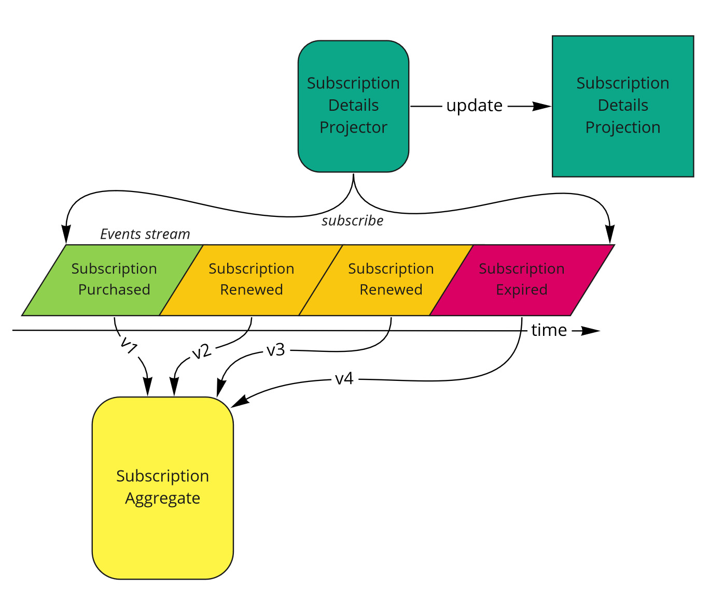

#### Tool

In order not to reinvent the wheel, the *SQL Stream Store* library was used. As the [documentation](https://sqlstreamstore.readthedocs.io/en/latest/) says:

*SQL Stream Store is a .NET library to assist with developing applications that use event sourcing or wish to use stream based patterns over a relational database and existing operational infrastructure.*

Like every library, it has its limitations and assumptions (I recommend the linked documentation chapter "Things you need to know before adopting"). For me, the most important 2 points from this chapter are:

1. *"Subscriptions (and thus projections) are **eventually consistent** and always will be."* This means that there will always be an inconsistency time from saving the event to the stream and processing the event by the projector(s).
2. *"No support for ambient System.Transaction scopes enforcing the concept of the stream as the consistency and transactional boundary."* This means that if we save the event to a events stream and want to save something **in the same transaction**, we must use [TransactionScope](https://learn.microsoft.com/en-us/dotnet/api/system.transactions.transactionscope?view=net-8.0). If we cannot use *TransactionScope* for some reason, we must accept the Eventual Consistency also in this case.

Other popular tools:

- [EventStore](https://eventstore.com/) *"An industrial-strength database solution built from the ground up for event sourcing."*
- [Marten](https://martendb.io/) *".NET Transactional Document DB and Event Store on PostgreSQL"*

#### Implementation

There are 2 main "flows" to handle:

- Command handling: change of state - adding new events to stream (writing)
- Projection of events to create read models

##### Command Handling

The whole process looks like this:

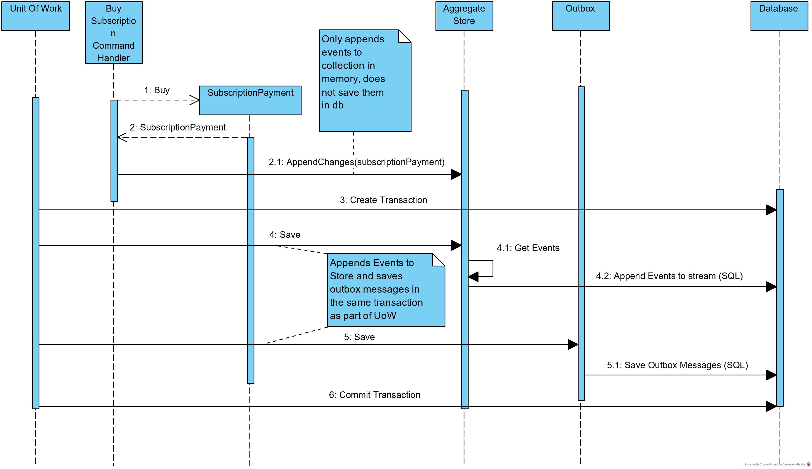

1. We create / update an aggregate by creating an event
2. We add changes to the Aggregate Store. This is the class responsible for writing / loading our aggregates. We are not saving changes yet.
3. As part of Unit Of Work  a) Aggregate Store adds events to the stream b) messages are added to the Outbox

Command Handler:

```csharp
public class BuySubscriptionCommandHandler : ICommandHandler<BuySubscriptionCommand, Guid>
{
    private readonly IAggregateStore _aggregateStore;

    private readonly IPayerContext _payerContext;

    private readonly ISqlConnectionFactory _sqlConnectionFactory;

    public BuySubscriptionCommandHandler(
        IAggregateStore aggregateStore, 
        IPayerContext payerContext, 
        ISqlConnectionFactory sqlConnectionFactory)
    {
        _aggregateStore = aggregateStore;
        _payerContext = payerContext;
        _sqlConnectionFactory = sqlConnectionFactory;
    }

    public async Task<Guid> Handle(BuySubscriptionCommand command, CancellationToken cancellationToken)
    {
        var priceList = await PriceListProvider.GetPriceList(_sqlConnectionFactory.GetOpenConnection());

        var subscriptionPayment = SubscriptionPayment.Buy(
            _payerContext.PayerId,
            SubscriptionPeriod.Of(command.SubscriptionTypeCode),
            command.CountryCode,
            MoneyValue.Of(command.Value, command.Currency),
            priceList);
        
        _aggregateStore.AppendChanges(subscriptionPayment);

        return subscriptionPayment.Id;
    }
}
```

`SubscriptionPayment` Aggregate:

```csharp
public class SubscriptionPayment : AggregateRoot
{
    private PayerId _payerId;

    private SubscriptionPeriod _subscriptionPeriod;

    private string _countryCode;

    private SubscriptionPaymentStatus _subscriptionPaymentStatus;

    private MoneyValue _value;

    protected override void Apply(IDomainEvent @event)
    {
        this.When((dynamic)@event);
    }

    public static SubscriptionPayment Buy(
        PayerId payerId,
        SubscriptionPeriod period,
        string countryCode,
        MoneyValue priceOffer,
        PriceList priceList)
    {
        var priceInPriceList = priceList.GetPrice(countryCode, period, PriceListItemCategory.New);
        CheckRule(new PriceOfferMustMatchPriceInPriceListRule(priceOffer, priceInPriceList));

        var subscriptionPayment = new SubscriptionPayment();

        var subscriptionPaymentCreated = new SubscriptionPaymentCreatedDomainEvent(
            Guid.NewGuid(),
            payerId.Value,
            period.Code,
            countryCode,
            SubscriptionPaymentStatus.WaitingForPayment.Code,
            priceOffer.Value,
            priceOffer.Currency);

        subscriptionPayment.Apply(subscriptionPaymentCreated);
        subscriptionPayment.AddDomainEvent(subscriptionPaymentCreated);

        return subscriptionPayment;
    }

    private void When(SubscriptionPaymentCreatedDomainEvent @event)
    {
        this.Id = @event.SubscriptionPaymentId;
        _payerId = new PayerId(@event.PayerId);
        _subscriptionPeriod = SubscriptionPeriod.Of(@event.SubscriptionPeriodCode);
        _countryCode = @event.CountryCode;
        _subscriptionPaymentStatus = SubscriptionPaymentStatus.Of(@event.Status);
        _value = MoneyValue.Of(@event.Value, @event.Currency);
    }
```

`AggregateRoot` base class:

```csharp
public abstract class AggregateRoot
{
    public Guid Id { get; protected set; }

    public int Version { get; private set; }

    private readonly List<IDomainEvent> _domainEvents;

    protected AggregateRoot()
    {
        _domainEvents = new List<IDomainEvent>();

        Version = -1;
    }

    protected void AddDomainEvent(IDomainEvent @event)
    {
        _domainEvents.Add(@event);
    }

    public IReadOnlyCollection<IDomainEvent> GetDomainEvents() => _domainEvents.AsReadOnly();

    public void Load(IEnumerable<IDomainEvent> history)
    {
        foreach (var e in history)
        {
            Apply(e);
            Version++;
        }
    }

    protected abstract void Apply(IDomainEvent @event);

    protected static void CheckRule(IBusinessRule rule)
    {
        if (rule.IsBroken())
        {
            throw new BusinessRuleValidationException(rule);
        }
    }
}

```

Aggregate Store implementation with SQL Stream Store library usage:

```csharp
public class SqlStreamAggregateStore : IAggregateStore
{
    private readonly IStreamStore _streamStore;

    private readonly List<IDomainEvent> _appendedChanges;

    private readonly List<AggregateToSave> _aggregatesToSave;

    public SqlStreamAggregateStore(
        ISqlConnectionFactory sqlConnectionFactory)
    {
        _appendedChanges = new List<IDomainEvent>();

        _streamStore =
            new MsSqlStreamStore(
                new MsSqlStreamStoreSettings(sqlConnectionFactory.GetConnectionString())
                    {
                        Schema = DatabaseSchema.Name
                });

        _aggregatesToSave = new List<AggregateToSave>();
    }

    public async Task Save()
    {
        foreach (var aggregateToSave in _aggregatesToSave)
        {
            await _streamStore.AppendToStream(
                GetStreamId(aggregateToSave.Aggregate),
                aggregateToSave.Aggregate.Version,
                aggregateToSave.Messages.ToArray());
        }

        _aggregatesToSave.Clear();
    }

    public async Task<T> Load<T>(AggregateId<T> aggregateId) where T : AggregateRoot
    {
        var streamId = GetStreamId(aggregateId);

        IList<IDomainEvent> domainEvents = new List<IDomainEvent>();
        ReadStreamPage readStreamPage;
        do
        {
            readStreamPage = await _streamStore.ReadStreamForwards(streamId, StreamVersion.Start, maxCount: 100);
            var messages = readStreamPage.Messages;
            foreach (var streamMessage in messages)
            {
                Type type = DomainEventTypeMappings.Dictionary[streamMessage.Type];
                var jsonData = await streamMessage.GetJsonData();
                var domainEvent = JsonConvert.DeserializeObject(jsonData, type) as IDomainEvent;

                domainEvents.Add(domainEvent);
            }
        } while (!readStreamPage.IsEnd);

        var aggregate = (T)Activator.CreateInstance(typeof(T), true);

        aggregate.Load(domainEvents);

        return aggregate;
    }

```

##### Events Projection

The whole process looks like this:

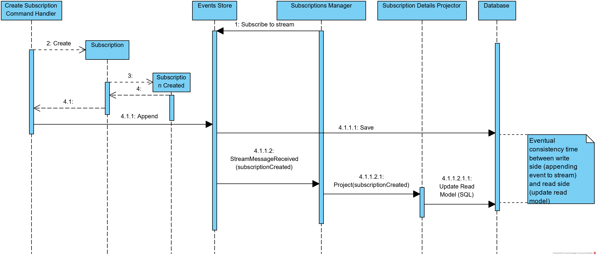

1. Special class `Subscriptions Manager` subscribes to Events Store (using SQL Store Stream library)
2. Events Store raises `StreamMessageRecievedEvent`
3. `Subscriptions Manager` invokes all projectors
4. If projector know how to handle given event, it updates particular read model. In current implementation it updates special table in SQL database.

`SubscriptionsManager` class implementation:

```csharp
public class SubscriptionsManager
{
    private readonly IStreamStore _streamStore;

    public SubscriptionsManager(
        IStreamStore streamStore)
    {
        _streamStore = streamStore;
    }

    public void Start()
    {
        long? actualPosition;

        using (var scope = PaymentsCompositionRoot.BeginLifetimeScope())
        {
            var checkpointStore = scope.Resolve<ICheckpointStore>();

            actualPosition = checkpointStore.GetCheckpoint(SubscriptionCode.All);
        }

        _streamStore.SubscribeToAll(actualPosition, StreamMessageReceived);
    }

    public void Stop()
    {
        _streamStore.Dispose();
    }

    private static async Task StreamMessageReceived(
        IAllStreamSubscription subscription, StreamMessage streamMessage, CancellationToken cancellationToken)
    {
        var type = DomainEventTypeMappings.Dictionary[streamMessage.Type];
        var jsonData = await streamMessage.GetJsonData(cancellationToken);
        var domainEvent = JsonConvert.DeserializeObject(jsonData, type) as IDomainEvent;

        using var scope = PaymentsCompositionRoot.BeginLifetimeScope();

        var projectors = scope.Resolve<IList<IProjector>>();

        var tasks = projectors
            .Select(async projector =>
            {
                await projector.Project(domainEvent);
            });

        await Task.WhenAll(tasks);

        var checkpointStore = scope.Resolve<ICheckpointStore>();
        await checkpointStore.StoreCheckpoint(SubscriptionCode.All, streamMessage.Position);
    }
}

```

Example projector:

```csharp
internal class SubscriptionDetailsProjector : ProjectorBase, IProjector
{
    private readonly IDbConnection _connection;

    public SubscriptionDetailsProjector(ISqlConnectionFactory sqlConnectionFactory)
    {
        _connection = sqlConnectionFactory.GetOpenConnection();
    }

    public async Task Project(IDomainEvent @event)
    {
        await When((dynamic) @event);
    }

    private async Task When(SubscriptionRenewedDomainEvent subscriptionRenewed)
    {
        var period = SubscriptionPeriod.GetName(subscriptionRenewed.SubscriptionPeriodCode);
        
        await _connection.ExecuteScalarAsync("UPDATE payments.SubscriptionDetails " +
                                                "SET " +
                                                    "[Status] = @Status, " +
                                                    "[ExpirationDate] = @ExpirationDate, " +
                                                    "[Period] = @Period " +
                                                "WHERE [Id] = @SubscriptionId",
            new
            {
                subscriptionRenewed.SubscriptionId,
                subscriptionRenewed.Status,
                subscriptionRenewed.ExpirationDate,
                period
            });
    }

    private async Task When(SubscriptionExpiredDomainEvent subscriptionExpired)
    {
        await _connection.ExecuteScalarAsync("UPDATE payments.SubscriptionDetails " +
                                             "SET " +
                                             "[Status] = @Status " +
                                             "WHERE [Id] = @SubscriptionId",
            new
            {
                subscriptionExpired.SubscriptionId,
                subscriptionExpired.Status
            });
    }

    private async Task When(SubscriptionCreatedDomainEvent subscriptionCreated)
    {
        var period = SubscriptionPeriod.GetName(subscriptionCreated.SubscriptionPeriodCode);
        
        await _connection.ExecuteScalarAsync("INSERT INTO payments.SubscriptionDetails " +
                                       "([Id], [Period], [Status], [CountryCode], [ExpirationDate]) " +
                                       "VALUES (@SubscriptionId, @Period, @Status, @CountryCode, @ExpirationDate)",
            new
            {
                subscriptionCreated.SubscriptionId,
                period,
                subscriptionCreated.Status,
                subscriptionCreated.CountryCode,
                subscriptionCreated.ExpirationDate
            });
    }
}

```

#### Sample view of Event Store

Sample *Event Store* view after execution of SubscriptionLifecycleTests Integration Test which includes following steps:

1. Creating Price List
2. Buying Subscription
3. Renewing Subscription
4. Expiring Subscription

looks like this (*SQL Stream Store* table - *payments.Messages*):

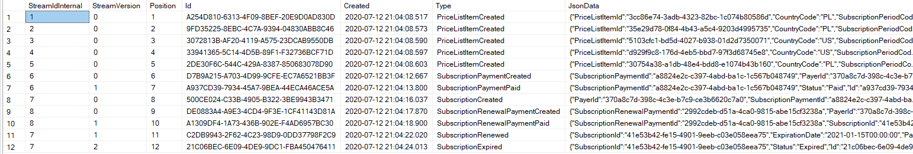

### 3.16 Database Change Management

Database change management is accomplished by *migrations/transitions* versioning. Additionally, the current state of the database structure is also versioned.

Migrations are applied using a simple [DatabaseMigrator](src/Database/DatabaseMigrator) console application that uses the [DbUp](https://dbup.readthedocs.io/en/latest/) library. The current state of the database structure is kept in the [SSDT Database Project](https://docs.microsoft.com/en-us/sql/ssdt/how-to-create-a-new-database-project).

The database update is performed by running the following command:

```shell
dotnet DatabaseMigrator.dll "connection_string" "scripts_directory_path"
```

The entire solution is described in detail in the following articles:

1. [Database change management](https://www.kamilgrzybek.com/database/database-change-management/) (theory)
2. [Using database project and DbUp for database management](https://www.kamilgrzybek.com/database/using-database-project-and-dbup-for-database-management/) (implementation)

### 3.17 Continuous Integration

#### Definition

As defined on [Martin Fowler's website](https://martinfowler.com/articles/continuousIntegration.html):
> *Continuous Integration is a software development practice where members of a team integrate their work frequently, usually each person integrates at least daily - leading to multiple integrations per day. Each integration is verified by an automated build (including test) to detect integration errors as quickly as possible.*

#### YAML Implementation [OBSOLETE]

*Originally the build was implemented using yaml and GitHub Actions functionality. Currently, the build is implemented with NUKE (see next section). See [buildPipeline.yml](.github/workflows/buildPipeline.yml)* file history.

##### Pipeline description

CI was implemented using [GitHub Actions](https://docs.github.com/en/actions/getting-started-with-github-actions/about-github-actions). For this purpose, one workflow, which triggers on Pull Request to *master* branch or Push to *master* branch was created. It contains 2 jobs:

- build test, execute Unit Tests and Architecture Tests
- execute Integration Tests


**Steps description**<br/>
a) Checkout repository - clean checkout of git repository <br/>
b) Setup .NET - install .NET 8.0 SDK<br/>
c) Install dependencies - resolve NuGet packages<br/>
d) Build - build solution<br/>
e) Run Unit Tests - run automated Unit Tests (see section 3.10)<br/>
f) Run Architecture Tests - run automated Architecture Tests (see section 3.12)<br/>
g) Initialize containers - setup Docker container for MS SQL Server<br/>
h) Wait for SQL Server initialization - after container initialization MS SQL Server is not ready, initialization of server itself takes some time so 30 seconds timeout before execution of next step is needed<br/>
i) Create Database - create and initialize database<br/>
j) Migrate Database - execute database upgrade using *DatabaseMigrator* application (see 3.16 section)<br/>
k) Run Integration Tests - perform Integration and System Integration Testing (see section 3.13 and 3.14)<br/>

##### Workflow definition

Workflow definition: [buildPipeline.yml](.github/workflows/buildPipeline.yml)

##### Example workflow execution

Example workflow output:

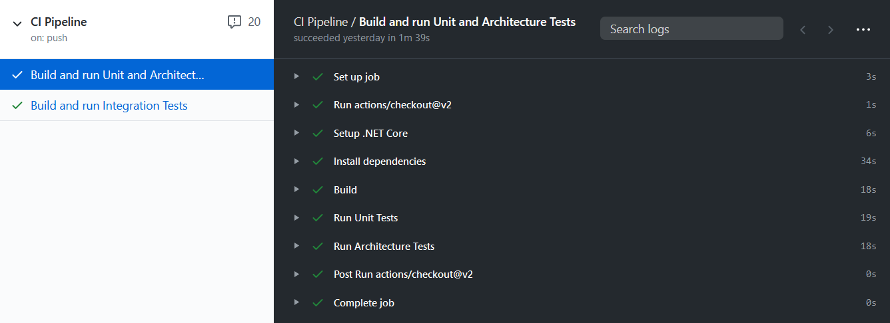

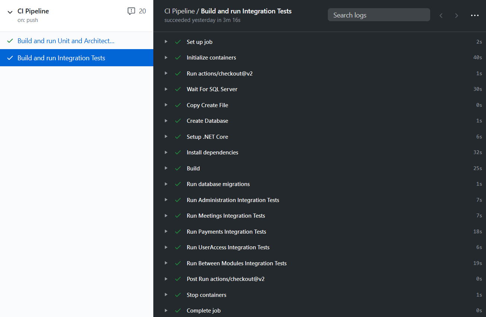

#### NUKE

[Nuke](https://nuke.build/) is *the cross-platform build automation solution for .NET with C# DSL.*

The 2 main advantages of its use over pure yaml defined in GitHub actions are as follows:

- You run the same code on local machine and in the build server. See [buildPipeline.yml](.github/workflows/buildPipeline.yml)
- You use C# with all the goodness (debugging, compilation, packages, refactoring and so on)

This is how one of the stage definition looks like (execute Build, Unit Tests, Architecture Tests) [Build.cs](build/Build.cs):

```csharp
partial class Build : NukeBuild
{
    /// Support plugins are available for:
    ///   - JetBrains ReSharper        https://nuke.build/resharper
    ///   - JetBrains Rider            https://nuke.build/rider
    ///   - Microsoft VisualStudio     https://nuke.build/visualstudio
    ///   - Microsoft VSCode           https://nuke.build/vscode

    public static int Main () => Execute<Build>(x => x.Compile);

    [Parameter("Configuration to build - Default is 'Debug' (local) or 'Release' (server)")]
    readonly Configuration Configuration = IsLocalBuild ? Configuration.Debug : Configuration.Release;

    [Solution] readonly Solution Solution;

    Target Clean => _ => _
        .Before(Restore)
        .Executes(() =>
        {
            EnsureCleanDirectory(WorkingDirectory);
        });

    Target Restore => _ => _
        .Executes(() =>
        {
            DotNetRestore(s => s
                .SetProjectFile(Solution));
        });

    Target Compile => _ => _
        .DependsOn(Restore)
        .Executes(() =>
        {
            DotNetBuild(s => s
                .SetProjectFile(Solution)
                .SetConfiguration(Configuration)
                .EnableNoRestore());
        });

    Target UnitTests => _ => _
        .DependsOn(Compile)
        .Executes(() =>
        {
            DotNetTest(s => s
                .SetProjectFile(Solution)
                .SetFilter("UnitTests")
                .SetConfiguration(Configuration)
                .EnableNoRestore()
                .EnableNoBuild());
        });

    Target ArchitectureTests => _ => _
        .DependsOn(UnitTests)
        .Executes(() =>
        {
            DotNetTest(s => s
                .SetProjectFile(Solution)
                .SetFilter("ArchTests")
                .SetConfiguration(Configuration)
                .EnableNoRestore()
                .EnableNoBuild());
        });

    Target BuildAndUnitTests => _ => _
        .Triggers(ArchitectureTests)
        .Executes(() =>
        {
        });
}

```

If you want to see more complex scenario when integration tests are executed (with SQL Server database creation using docker) see [BuildIntegrationTests.cs](build/BuildIntegrationTests.cs) file.

#### SQL Server database project build

Currently, compilation of database projects is not supported by the .NET Core and dotnet tool. For this reason, the [MSBuild.Sdk.SqlProj](https://github.com/rr-wfm/MSBuild.Sdk.SqlProj/) library was used. In order to do that, you need to create .NET standard library, change SDK and create links to scripts folders. Final [database project](src/Database/CompanyName.MyMeetings.Database.Build/CompanyName.MyMeetings.Database.Build.csproj) looks as follows:

```xml
<Project Sdk="MSBuild.Sdk.SqlProj/1.6.0">
    <PropertyGroup>
        <TargetFramework>netstandard2.0</TargetFramework>
    </PropertyGroup>
    <ItemGroup>
        <Content Include="..\CompanyName.MyMeetings.Database\administration\**\*.sql" />
        <Content Include="..\CompanyName.MyMeetings.Database\app\**\*.sql" />
        <Content Include="..\CompanyName.MyMeetings.Database\meetings\**\*.sql" />
        <Content Include="..\CompanyName.MyMeetings.Database\payments\**\*.sql" />
        <Content Include="..\CompanyName.MyMeetings.Database\users\**\*.sql" />
        <Content Include="..\CompanyName.MyMeetings.Database\Security\**\*.sql" />
    </ItemGroup>
</Project>
```

### 3.18 Static code analysis

In order to standardize the appearance of the code and increase its readability, the [StyleCopAnalyzers](https://github.com/DotNetAnalyzers/StyleCopAnalyzers) library was used. This library implements StyleCop rules using the .NET Compiler Platform and is responsible for the static code analysis.<br/>

Using this library is trivial - it is just added as a NuGet package to all projects. There are many ways to configure rules, but currently the best way to do this is to edit the [.editorconfig](src/.editorconfig) file. More information can be found at the link above.<br/>

**Note! Static code analysis works best when the following points are met:**<br/>

1. Each developer has an IDE that respects the rules and helps to follow them
2. The rules are checked during the project build process as part of Continuous Integration
3. The rules are set to *help your system grow*. **Static analysis is not a value in itself.** Some rules may not make complete sense and should be turned off. Other rules may have higher priority. It all depends on the project, company standards and people involved in the project. Be pragmatic.

### 3.19 System Under Test SUT

There is always a need to prepare the entire system in a specific state, e.g. for manual, exploratory, UX / UI tests. The fact that the tests are performed manually does not mean that we cannot automate the preparation phase (Given / Arrange). Thanks to the automation of system state preparation ([System Under Test](https://en.wikipedia.org/wiki/System_under_test)), we are able to recreate exactly the same state in any environment. In addition, such automation can be used later to automate the entire test (e.g. through an [3.13 Integration Tests](#313-integration-tests)).<br/>

The implementation of such automation based on the use of NUKE and the test framework is presented below. As in the case of integration testing, we use the public API of modules.

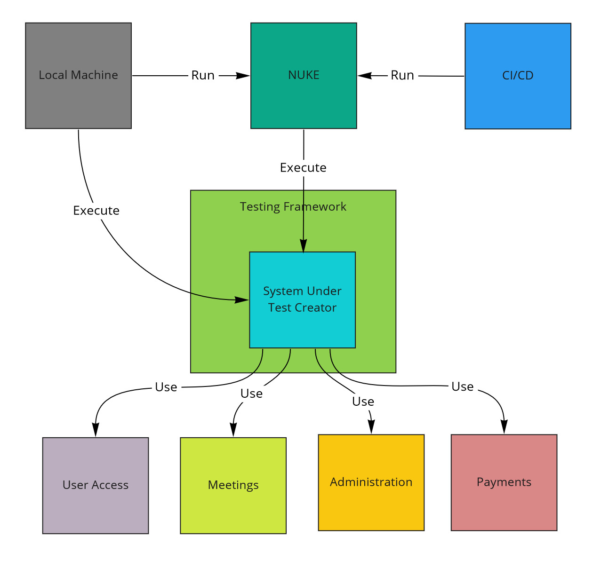

Below is a SUT whose task is to go through the whole process - from setting up a *Meeting Group*, through its *Payment*, adding a new *Meeting* and signing up for it by another user.

```csharp
public class CreateMeeting : TestBase
{
    protected override bool PerformDatabaseCleanup => true;

    [Test]
    public async Task Prepare()
    {
        await UsersFactory.GivenAdmin(
            UserAccessModule,
            "testAdmin@mail.com",
            "testAdminPass",
            "Jane Doe",
            "Jane",
            "Doe",
            "testAdmin@mail.com");

        var userId = await UsersFactory.GivenUser(
            UserAccessModule,
            ConnectionString,
            "adamSmith@mail.com",
            "adamSmithPass",
            "Adam",
            "Smith",
            "adamSmith@mail.com");

        ExecutionContextAccessor.SetUserId(userId);

        var meetingGroupId = await MeetingGroupsFactory.GivenMeetingGroup(
            MeetingsModule,
            AdministrationModule,
            ConnectionString,
            "Software Craft",
            "Group for software craft passionates",
            "Warsaw",
            "PL");

        await TestPriceListManager.AddPriceListItems(PaymentsModule, ConnectionString);

        await TestPaymentsManager.BuySubscription(
            PaymentsModule,
            ExecutionContextAccessor);
        
        SetDate(new DateTime(2022, 7, 1, 10, 0, 0));

        var meetingId = await TestMeetingFactory.GivenMeeting(
            MeetingsModule,
            meetingGroupId,
            "Tactical DDD",
            new DateTime(2022, 7, 10, 18, 0, 0),
            new DateTime(2022, 7, 10, 20, 0, 0),
            "Meeting about Tactical DDD patterns",
            "Location Name",
            "Location Address",
            "01-755",
            "Warsaw",
            50,
            0,
            null,
            null,
            0,
            null,
            new List<Guid>()
        );
        
        var attendeeUserId = await UsersFactory.GivenUser(
            UserAccessModule,
            ConnectionString,
            "rickmorty@mail.com",
            "rickmortyPass",
            "Rick",
            "Morty",
            "rickmorty@mail.com");
        
        ExecutionContextAccessor.SetUserId(attendeeUserId);

        await TestMeetingGroupManager.JoinToGroup(MeetingsModule, meetingGroupId);

        await TestMeetingManager.AddAttendee(MeetingsModule, meetingId, guestsNumber: 1);
    }
}
```

You can create this SUT using following *NUKE* target providing connection string and particular test name:

```shell
 .\build PrepareSUT --DatabaseConnectionString "connection_string" --SUTTestName CreateMeeting
```

### 3.20 Mutation Testing

#### Description

Mutation testing is an approach to test and evaluate our existing tests. During mutation testing a special framework modifies pieces of our code and runs our tests. These modifications are called *mutations* or *mutants*. If a given *mutation* does not cause a failure of at least once test, it means that the mutant has *survived* so our tests are probably not sufficient.

#### Example

In this repository, the [Stryker.NET](https://stryker-mutator.io/docs/stryker-net/Introduction) framework was used for mutation testing. In the simplest use, after installation, all you need to do is enter the directory of tests that you want to mutate and run the following command:

```shell
dotnet stryker
```

The result of this command is the *mutation report file*. Assuming we want to test the unit tests of the Meetings module, such a [report](docs/mutation-tests-reports/mutation-report.html) has been generated. This is its first page:

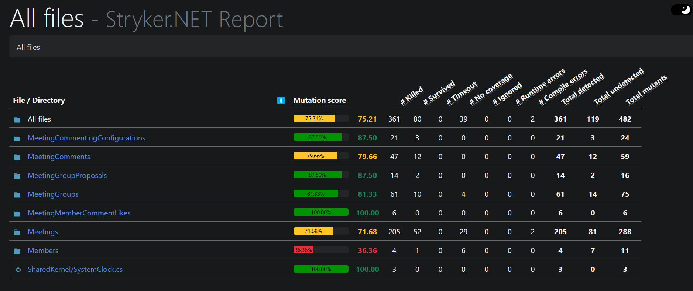

Let us analyze one of the places where the mutant survived. This is the *AddNotAttendee* method of the *Meeting* class. This method is used to add a *Member* to the list of people who have decided not to attend the meeting. According to the logic, if the same person previously indicated that he was going to the *Meeting* and later changed his mind, then if there is someone on the *Waiting List*, he should be added to the attendees. Based on requirements, this should be the person who signed up on the *Waiting List* **first** (based on **SignUpDate**).

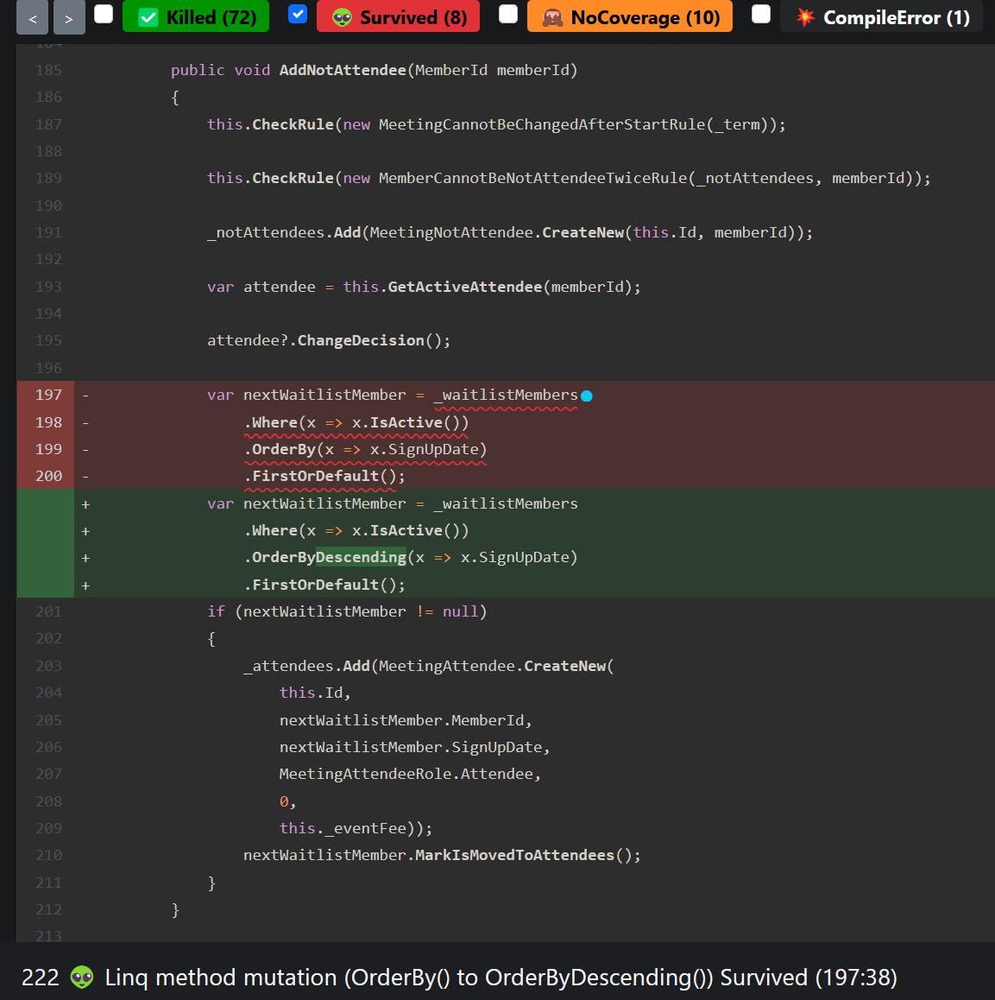

As you can see, the mutation framework changed our sorting in linq query (from default ascending to descending). However, each test was successful, so it means that mutant survived so we don't have a test that checks the correct sort based on *SignUpDate*.

From the example above, one more important thing can be deduced - **code coverage is insufficient**. In the given example, this code is covered, but our tests do not check the given requirement, therefore our code may have errors. Mutation testing allow to detect such situations. Of course, as with any tool, we should use it wisely, as not every case requires our attention.

## 4. Technology

List of technologies, frameworks and libraries used for implementation:

- [.NET 8.0](https://dotnet.microsoft.com/download) (platform). Note for Visual Studio users: **VS 2019** is required.
- [MS SQL Server Express](https://www.microsoft.com/en-us/sql-server/sql-server-editions-express) (database)
- [Entity Framework Core 8.0](https://docs.microsoft.com/en-us/ef/core/) (ORM Write Model implementation for DDD)
- [Autofac](https://autofac.org/) (Inversion of Control Container)
- [IdentityServer4](http://docs.identityserver.io) (Authentication and Authorization)
- [Serilog](https://serilog.net/) (structured logging)
- [Hellang.Middleware.ProblemDetails](https://github.com/khellang/Middleware/tree/master/src/ProblemDetails) (API Problem Details support)
- [Swashbuckle](https://github.com/domaindrivendev/Swashbuckle) (Swagger automated documentation)
- [Dapper](https://github.com/StackExchange/Dapper) (micro ORM for Read Model)
- [Newtonsoft.Json](https://www.newtonsoft.com/json) (serialization/deserialization to/from JSON)
- [Quartz.NET](https://www.quartz-scheduler.net/) (background processing)
- [FluentValidation](https://fluentvalidation.net/) (data validation)
- [MediatR](https://github.com/jbogard/MediatR) (mediator implementation)
- [Postman](https://www.getpostman.com/) (API tests)
- [NUnit](https://nunit.org/) (Testing framework)
- [NSubstitute](https://nsubstitute.github.io/) (Testing isolation framework)
- [Visual Paradigm Community Edition](https://www.visual-paradigm.com/download/community.jsp) (CASE tool for modeling and documentation)
- [NetArchTest](https://github.com/BenMorris/NetArchTest) (Architecture Unit Tests library)
- [Polly](https://github.com/App-vNext/Polly) (Resilience and transient-fault-handling library)
- [SQL Stream Store](https://github.com/SQLStreamStore) (Library to assist with Event Sourcing)
- [DbUp](https://dbup.readthedocs.io/en/latest/) (Database migrations deployment)
- [SSDT Database Project](https://docs.microsoft.com/en-us/sql/ssdt/how-to-create-a-new-database-project) (Database structure versioning)
- [GitHub Actions](https://docs.github.com/en/actions) (Continuous Integration workflows implementation)
- [StyleCopAnalyzers](https://github.com/DotNetAnalyzers/StyleCopAnalyzers) (Static code analysis library)
- [PlantUML](https://plantuml.com) (UML diagrams from textual description, diagrams as text)
- [C4 Model](https://c4model.com/) (Model for visualising software architecture)
- [C4-PlantUML](https://github.com/plantuml-stdlib/C4-PlantUML) (C4 Model for PlantUML plugin)
- [NUKE](https://nuke.build/) (Build automation system)
- [MSBuild.Sdk.SqlProj](https://github.com/rr-wfm/MSBuild.Sdk.SqlProj/) (Database project compilation)
- [Stryker.NET](https://stryker-mutator.io/docs/stryker-net/Introduction) (Mutation Testing framework)

## 5. How to Run

### Install .NET 8.0 SDK

- [Download](https://dotnet.microsoft.com/en-us/download/dotnet/8.0) and install .NET 8.0 SDK

### Create database

- Download and install MS SQL Server Express or other
- Create an empty database using [CreateDatabase_Windows.sql](src/Database/CompanyName.MyMeetings.Database/Scripts/CreateDatabase_Windows.sql) or [CreateDatabase_Linux.sql](src/Database/CompanyName.MyMeetings.Database/Scripts/CreateDatabase_Linux.sql). Script adds **app** schema which is needed for migrations journal table. Change database file path if needed.
- Run database migrations using **MigrateDatabase** NUKE target by executing the build.sh script present in the root folder:

```shell
.\build MigrateDatabase --DatabaseConnectionString "connection_string"
```

*"connection_string"* - connection string to your database

### Seed database

- Execute [SeedDatabase.sql](src/Database/CompanyName.MyMeetings.Database/Scripts/SeedDatabase.sql) script
- 2 test users will be created - check the script for usernames and passwords

### Configure connection string

Set a database connection string called `MeetingsConnectionString` in the root of the API project's appsettings.json or use [Secrets](https://blogs.msdn.microsoft.com/mihansen/2017/09/10/managing-secrets-in-net-core-2-0-apps/)

Example config setting in appsettings.json for a database called `MyMeetings`:

```json
{
 "MeetingsConnectionString": "Server=(localdb)\\mssqllocaldb;Database=MyMeetings;Trusted_Connection=True;"
}
```

### Configure startup in IDE

- Set the Startup Item in your IDE to the API Project, not IIS Express

### Authenticate

- Once it is running you'll need a token to make API calls. This is done via OAuth2 [Resource Owner Password Grant Type](https://www.oauth.com/oauth2-servers/access-tokens/password-grant/). By default IdentityServer is configured with the following:
- `client_id = ro.client`
- `client_secret = secret` **(this is literally the value - not a statement that this value is secret!)**
- `scope = myMeetingsAPI openid profile`
- `grant_type = password`

Include the credentials of a test user created in the [SeedDatabase.sql](src/Database/CompanyName.MyMeetings.Database/Scripts/SeedDatabase.sql) script - for example:

- `username = testMember@mail.com`
- `password = testMemberPass`

**Example HTTP Request for an Access Token:**

```http
POST /connect/token HTTP/1.1
Host: localhost:5000
 
grant_type=password
&username=testMember@mail.com
&password=testMemberPass
&client_id=ro.client
&client_secret=secret
```

This will fetch an access token for this user to make authorized API requests using the HTTP request header `Authorization: Bearer <access_token>`

If you use a tool such as Postman to test your API, the token can be fetched and stored within the tool itself and appended to all API calls. Check your tool documentation for instructions.

### Run using Docker Compose

You can run whole application using [docker compose](https://docs.docker.com/compose/) from root folder:

```shell
docker-compose up
```

It will create following services: <br/>

- MS SQL Server Database
- Database Migrator
- Application

### Run Integration Tests in Docker

You can run all Integration Tests in Docker (exactly the same process is executed on CI) using **RunAllIntegrationTests** NUKE target:

```shell
.\build RunAllIntegrationTests
```

## 6. Contribution

This project is still under analysis and development. I assume its maintenance for a long time and I would appreciate your contribution to it. Please let me know by creating an Issue or Pull Request.

## 7. Roadmap

List of features/tasks/approaches to add:

| Name                               | Status | Release date |
|------------------------------------| -------- |--------------|
| Domain Model Unit Tests            |Completed | 2019-09-10   |
| Architecture Decision Log update   |  Completed | 2019-11-09   |
| Integration automated tests        | Completed | 2020-02-24   |
| Migration to .NET Core 3.1         |Completed  | 2020-03-04   |
| System Integration Testing         | Completed  | 2020-03-28   |
| More advanced Payments module      | Completed  | 2020-07-11   |
| Event Sourcing implementation      | Completed  | 2020-07-11   |
| Database Change Management         | Completed  | 2020-08-23   |
| Continuous Integration             | Completed  | 2020-09-01   |
| StyleCop Static Code Analysis      | Completed  | 2020-09-05   |
| FrontEnd SPA application           | Completed | 2020-11-08   |
| Docker support                     | Completed | 2020-11-26   |
| PlantUML Conceptual Model          | Completed | 2021-03-22   |
| C4 Model                           | Completed | 2021-03-29   |
| Meeting comments feature           | Completed | 2021-03-30   |
| NUKE build automation              | Completed | 2021-06-15   |
| Database project compilation on CI | Completed | 2021-06-15   |
| System Under Test implementation   | Completed | 2022-07-17   |
| Mutation Testing                   | Completed | 2022-08-23   |
| Migration to .NET 8.0              | Completed | 2023-12-09   |

NOTE: Please don't hesitate to suggest something else or a change to the existing code. All proposals will be considered.

## 8. Authors

Kamil Grzybek

Blog: [https://kamilgrzybek.com](https://kamilgrzybek.com)

Twitter: [https://twitter.com/kamgrzybek](https://twitter.com/kamgrzybek)

LinkedIn: [https://www.linkedin.com/in/kamilgrzybek/](https://www.linkedin.com/in/kamilgrzybek/)

GitHub: [https://github.com/kgrzybek](https://github.com/kgrzybek)

### 8.1 Main contributors

- [Andrei Ganichev](https://github.com/AndreiGanichev)
- [Bela Istok](https://github.com/bistok)
- [Almar Aubel](https://github.com/AlmarAubel)

## 9. License

The project is under [MIT license](https://opensource.org/licenses/MIT).

## 10. Inspirations and Recommendations

### Modular Monolith

- ["Modular Monolith: A Primer"](https://www.kamilgrzybek.com/design/modular-monolith-primer/) Modular Monolith architecture article series, Kamil Grzybek
- ["Modular Monolith Architecture: One to rule them all"](https://www.youtube.com/watch?v=njDSXUWeik0) presentation, Kamil Grzybek
- ["Modular Monoliths"](https://www.youtube.com/watch?v=5OjqD-ow8GE) presentation, Simon Brown
- ["Majestic Modular Monoliths"](https://www.youtube.com/watch?v=BOvxJaklcr0) presentation, Axel Fontaine
- ["Building Better Monoliths – Modulithic Applications with Spring Boot"](https://speakerdeck.com/olivergierke/building-better-monoliths-modulithic-applications-with-spring-boot-cd16e6ec-d334-497d-b9f6-3f92d5db035a) slides, Oliver Drotbohm
- ["MonolithFirst"](https://martinfowler.com/bliki/MonolithFirst.html) article, Martin Fowler
- ["Pattern: Monolithic Architecture"](https://microservices.io/patterns/monolithic.html) pattern description, Chris Richardson

### Domain-Driven Design

- ["Domain-Driven Design: Tackling Complexity in the Heart of Software"](https://www.amazon.com/Domain-Driven-Design-Tackling-Complexity-Software/dp/0321125215) book, Eric Evans
- ["Implementing Domain-Driven Design"](https://www.amazon.com/Implementing-Domain-Driven-Design-Vaughn-Vernon/dp/0321834577) book, Vaughn Vernon
- ["Domain-Driven Design Distilled"](https://www.amazon.com/dp/0134434420) book, Vaughn Vernon
- ["Patterns, Principles, and Practices of Domain-Driven Design"](https://www.amazon.com/Patterns-Principles-Practices-Domain-Driven-Design-ebook/dp/B00XLYUA0W) book, Scott Millett, Nick Tune
- ["Secure By Design"](https://www.amazon.com/Secure-Design-Daniel-Deogun/dp/1617294357) book, Daniel Deogun, Dan Bergh Johnsson, Daniel Sawano
- ["Hands-On Domain-Driven Design with .NET Core: Tackling complexity in the heart of software by putting DDD principles into practice"](https://www.amazon.com/Hands-Domain-Driven-Design-NET-ebook/dp/B07C5WSR9B) book, Alexey Zimarev
- ["Domain Modeling Made Functional: Tackle Software Complexity with Domain-Driven Design and F#"](https://www.amazon.com/Domain-Modeling-Made-Functional-Domain-Driven-ebook/dp/B07B44BPFB) book, Scott Wlaschin
- ["DDD by examples - library"](https://github.com/ddd-by-examples/library) GH repository, Jakub Pilimon, Bartłomiej Słota
- ["IDDD_Samples"](https://github.com/VaughnVernon/IDDD_Samples) GH repository, Vaughn Vernon
- ["IDDD_Samples_NET"](https://github.com/VaughnVernon/IDDD_Samples_NET) GH repository, Vaughn Vernon
- ["Awesome Domain-Driven Design"](https://github.com/heynickc/awesome-ddd) GH repository, Nick Chamberlain

### Application Architecture

- ["Patterns of Enterprise Application Architecture"](https://martinfowler.com/books/eaa.html) book, Martin Fowler
- ["Dependency Injection Principles, Practices, and Patterns"](https://www.manning.com/books/dependency-injection-principles-practices-patterns) book, Steven van Deursen, Mark Seemann
- ["Clean Architecture: A Craftsman's Guide to Software Structure and Design (Robert C. Martin Series"](https://www.amazon.com/Clean-Architecture-Craftsmans-Software-Structure/dp/0134494164) book, Robert C. Martin
- ["The Clean Architecture"](https://blog.cleancoder.com/uncle-bob/2012/08/13/the-clean-architecture.html) article, Robert C. Martin
- ["The Onion Architecture"](https://jeffreypalermo.com/2008/07/the-onion-architecture-part-1/) article series, Jeffrey Palermo
- ["Hexagonal/Ports & Adapters Architecture"](https://web.archive.org/web/20180822100852/http://alistair.cockburn.us/Hexagonal+architecture) article, Alistair Cockburn
- ["DDD, Hexagonal, Onion, Clean, CQRS, … How I put it all together"](https://herbertograca.com/2017/11/16/explicit-architecture-01-ddd-hexagonal-onion-clean-cqrs-how-i-put-it-all-together/) article, Herberto Graca

### Software Architecture

- ["Software Architecture in Practice (3rd Edition)"](https://www.amazon.com/Software-Architecture-Practice-3rd-Engineering/dp/0321815734) book, Len Bass, Paul Clements, Rick Kazman
- ["Software Architecture for Developers Vol 1 & 2"](https://softwarearchitecturefordevelopers.com/) book, Simon Brown
- ["Just Enough Software Architecture: A Risk-Driven Approach"](https://www.amazon.com/Just-Enough-Software-Architecture-Risk-Driven/dp/0984618104) book, George H. Fairbanks
- ["Software Systems Architecture: Working With Stakeholders Using Viewpoints and Perspectives (2nd Edition)"](https://www.amazon.com/Software-Systems-Architecture-Stakeholders-Perspectives/dp/032171833X/) book, Nick Rozanski, Eóin Woods
- ["Design It!: From Programmer to Software Architect (The Pragmatic Programmers)"](https://www.amazon.com/Design-Programmer-Architect-Pragmatic-Programmers/dp/1680502093) book, Michael Keeling

### System Architecture

- ["Enterprise Integration Patterns : Designing, Building, and Deploying Messaging Solutions"](https://www.enterpriseintegrationpatterns.com/) book and catalogue, Gregor Hohpe, Bobby Woolf
- ["Designing Data-Intensive Applications: The Big Ideas Behind Reliable, Scalable, and Maintainable Systems "](https://www.amazon.com/Designing-Data-Intensive-Applications-Reliable-Maintainable/dp/1449373321) book, Martin Kleppman
- ["Building Evolutionary Architectures: Support Constant Change"](https://www.amazon.com/Building-Evolutionary-Architectures-Support-Constant/dp/1491986360) book, Neal Ford
- ["Building Microservices: Designing Fine-Grained Systems"](https://www.amazon.com/Building-Microservices-Designing-Fine-Grained-Systems/dp/1491950358) book, Sam Newman

### Design

- ["Refactoring: Improving the Design of Existing Code"](https://www.amazon.com/Refactoring-Improving-Design-Existing-Code/dp/0201485672) book, Martin Fowler, Kent Beck, John Brant, William Opdyke, Don Roberts
- ["Clean Code: A Handbook of Agile Software Craftsmanship"](https://www.amazon.com/Clean-Code-Handbook-Software-Craftsmanship/dp/0132350882) book, Robert C. Martin
- ["Agile Principles, Patterns, and Practices in C#"](https://www.amazon.com/Agile-Principles-Patterns-Practices-C/dp/0131857258) book, Robert C. Martin
- ["Applying UML and Patterns: An Introduction to Object-Oriented Analysis and Design and Iterative Development (3rd Edition)"](https://www.amazon.com/Applying-UML-Patterns-Introduction-Object-Oriented/dp/0131489062) book, Craig Larman
- ["Working Effectively with Legacy Code"](https://www.amazon.com/Working-Effectively-Legacy-Michael-Feathers/dp/0131177052) book, Michael Feathers
- ["Code Complete: A Practical Handbook of Software Construction, Second Edition"](https://www.amazon.com/Code-Complete-Practical-Handbook-Construction/dp/0735619670) book, Steve McConnell
- ["Design Patterns: Elements of Reusable Object-Oriented Software"](https://www.amazon.com/Design-Patterns-Elements-Reusable-Object-Oriented/dp/0201633612) book, Erich Gamma, Richard Helm, Ralph Johnson, John Vlissides

### Craftsmanship

- ["The Clean Coder: A Code of Conduct for Professional Programmers"](https://www.amazon.com/Clean-Coder-Conduct-Professional-Programmers/dp/0137081073) book, Robert C. Martin
- ["The Pragmatic Programmer: From Journeyman to Master"](https://www.amazon.com/Pragmatic-Programmer-Journeyman-Master/dp/020161622X) book, Andrew Hunt

### Testing

- ["The Art of Unit Testing: with examples in C#"](https://www.amazon.com/Art-Unit-Testing-examples/dp/1617290890) book, Roy Osherove
- ["Unit Test Your Architecture with ArchUnit"](https://blogs.oracle.com/javamagazine/unit-test-your-architecture-with-archunit) article, Jonas Havers
- ["Unit Testing Principles, Practices, and Patterns"](https://www.amazon.com/Unit-Testing-Principles-Practices-Patterns/dp/1617296279) book, Vladimir Khorikov
- ["Growing Object-Oriented Software, Guided by Tests"](https://www.amazon.com/Growing-Object-Oriented-Software-Guided-Tests/dp/0321503627) book, Steve Freeman, Nat Pryce
- [Automated Tests](https://www.kamilgrzybek.com/blog/series/automated-tests) article series, Kamil Grzybek

### UML

- ["UML Distilled: A Brief Guide to the Standard Object Modeling Language (3rd Edition)"](https://www.amazon.com/UML-Distilled-Standard-Modeling-Language/dp/0321193687) book, Martin Fowler

### Event Storming

- ["Introducing EventStorming"](https://leanpub.com/introducing_eventstorming) book, Alberto Brandolini
- ["Awesome EventStorming"](https://github.com/mariuszgil/awesome-eventstorming) GH repository, Mariusz Gil

### Event Sourcing

- ["Hands-On Domain-Driven Design with .NET Core: Tackling complexity in the heart of software by putting DDD principles into practice"](https://www.amazon.com/Hands-Domain-Driven-Design-NET-ebook/dp/B07C5WSR9B) book, Alexey Zimarev
- ["Versioning in an Event Sourced System"](https://leanpub.com/esversioning) book, Greg Young
- [Hands-On-Domain-Driven-Design-with-.NET-Core](https://github.com/PacktPublishing/Hands-On-Domain-Driven-Design-with-.NET-Core) GH repository, Alexey Zimarev
- [EventSourcing.NetCore](https://github.com/oskardudycz/EventSourcing.NetCore) GH repository, Oskar Dudycz
